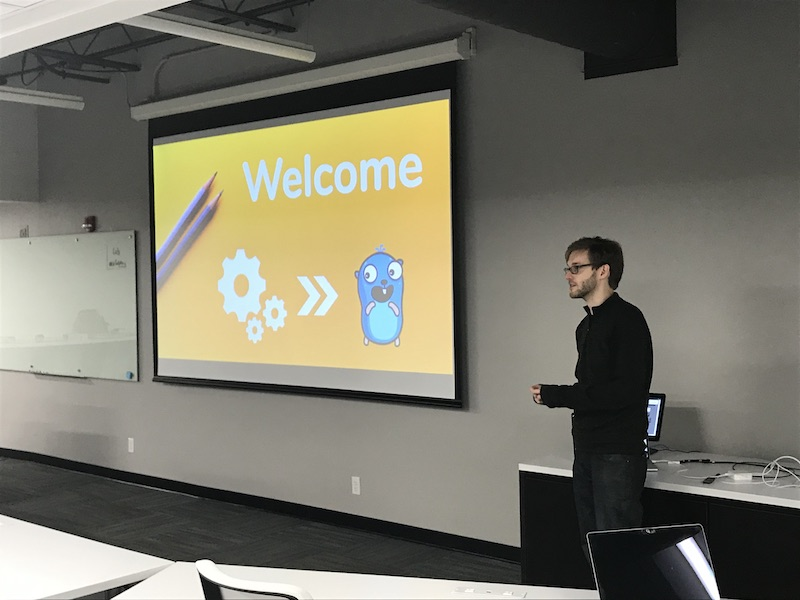
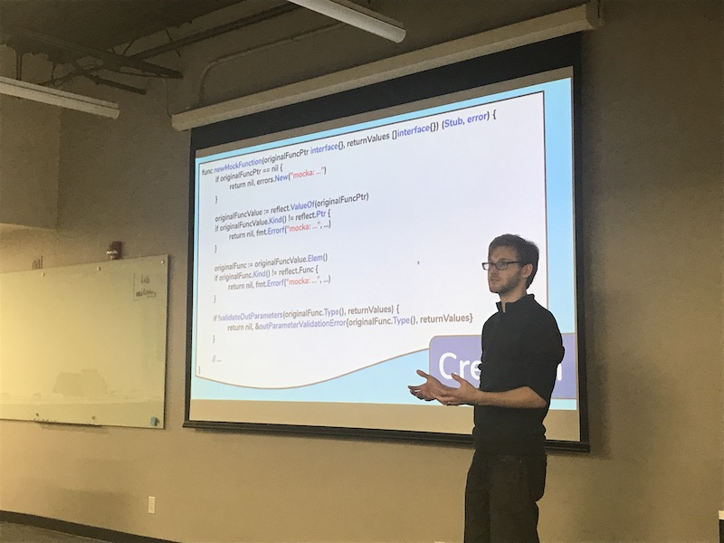
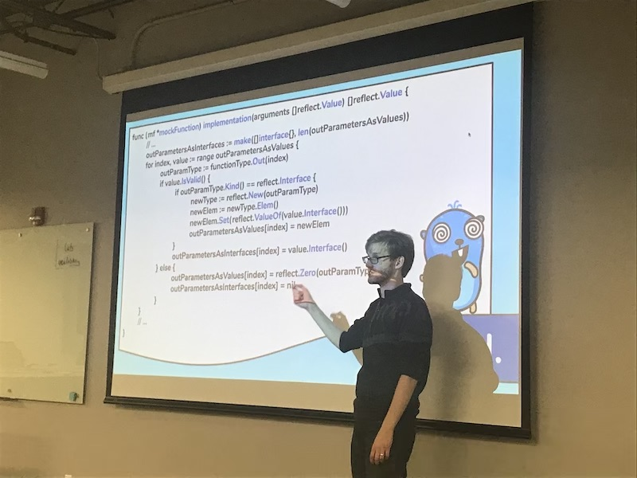
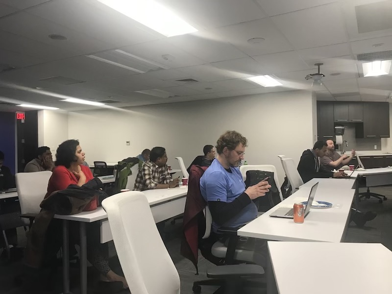
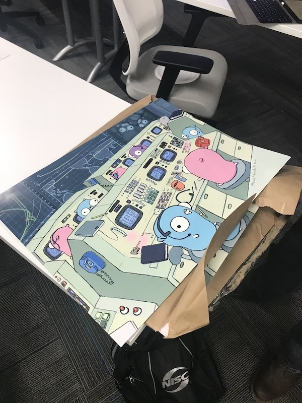

# Mocka - Function in Golang (Rescheduled)
https://www.meetup.com/StL-Go/events/268159688/

## Meta 
| | |
| --- | --- |
| **When:** | Wednesday, February 26, 2020 |
| **Where:** | Object Computing (OCI), |
| | 12140 Woodcrest Executive Dr. |
| | St. Louis, MO 63141 |
| | :round_pushpin: 38.673912,-90.453064 |
| **Presenter:** | Chris Marfia |
| **Total Attendance:** | 15 |

## Presentation
In this session Chris Marfia will be introducing a new mocking and stubbing package named [Mocka](https://github.com/MonsantoCo/mocka). This package was authored and open-sourced by Chris at Bayer late last year. Chris will be walking through how Mocka came to be, how to use it, what features it has, and how it works internally. Please join Chris and see how you can leverage this new package to start mocking and stubbing in Go.

## Presenter
Chris Marfia is a software engineer and consultant. His true passions are teaching, mentoring, and learning new languages. When he is not working you will find him hosting full day training workshops, finding new innovative ways to teach, or being an active father in his son's life.

## Photos
|  |  |
| --- | --- |
|  |  |
|  |  |
|  |  |
