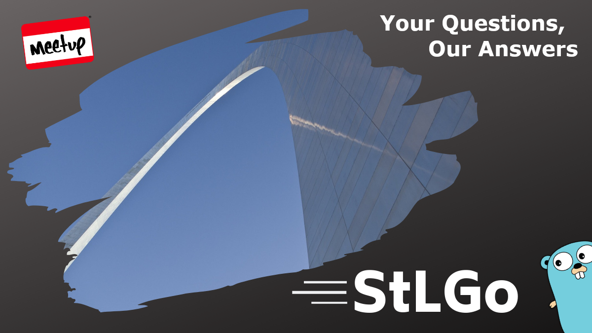
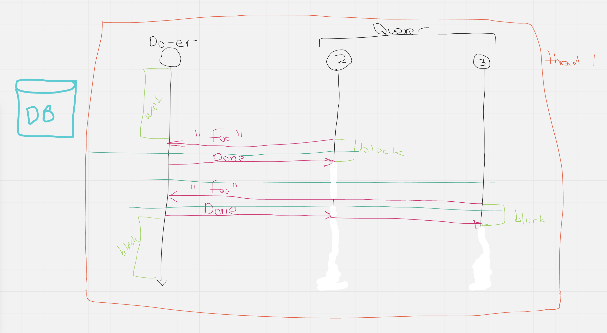
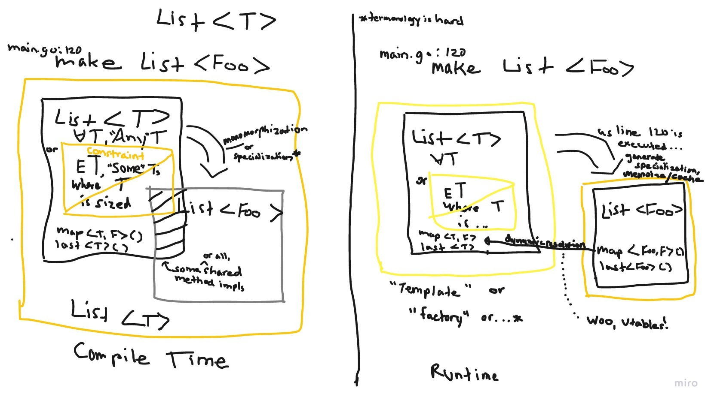

# Murphy's Law: An Introspective
https://www.meetup.com/StL-Go/events/269773507/

## Meta 
| | |
| --- | --- |
| **When:** | Wednesday, April 29, 2020 (Rescheduled from 4/22) |
| **Where:** | VIRTUAL EVENT, CrowdCast |
| **Presenter:** | Steering Committee |
| **Group Membership:** | 352 |
| **Total RSVPs:** | 47 |
| **Total Attendance:** | 10 |

## Presentation
This was a last minute save for the previously scheduled "A Formal Look: Go Concurrency" by Sabree Blackmon.

We ended up having a general Q&A session with the panel (and by "panel", I really mean Sabree) answering questions from the audience.  

### Shownotes:
* (5:30) Let's try some [Lean Coffee Table](https://www.leancoffeetable.com/TaskBoard/View/aef9969f-212c-4dd5-b06c-1a5900265f62?guest=true) to get some topic suggestions and allow voting.
* (11:20) The StLGo Meetup group has a [Github repo](https://github.com/stlgo) to someday contain project(s) and/or learning materials.
* (12:45) General Overview of Concurrency: ["Green Threads"](https://c9x.me/articles/gthreads/intro.html), [Goroutines](https://www.golang-book.com/books/intro/10#section1), and [Channels](https://www.golang-book.com/books/intro/10#section2).

* (58:30) Generics in Go.  Considerations related to compile time vs. runtime.

* (1:25:00) To Context or not to Context?
* (1:30:30) Writing security-specific test cases.  The [Agile Application Security](http://shop.oreilly.com/product/0636920045106.do) book was recommended.

## Recording
https://www.crowdcast.io/e/20200422-stlgomeetup

