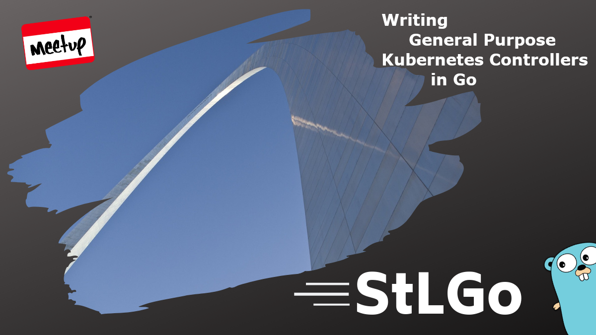
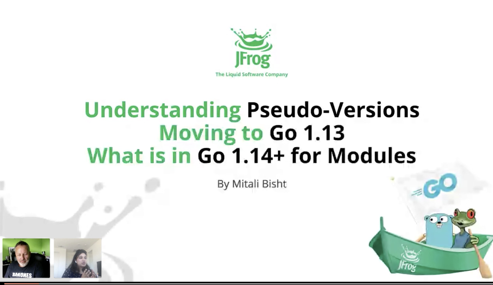
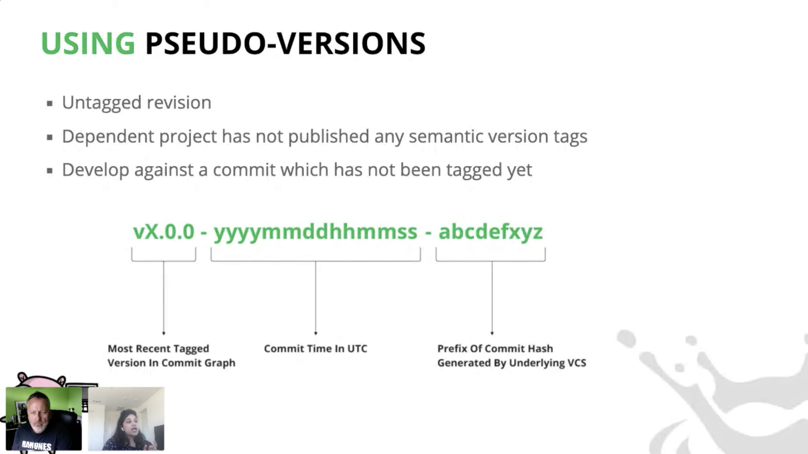
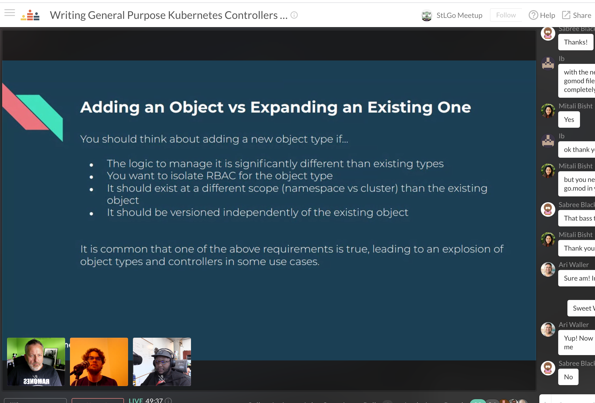
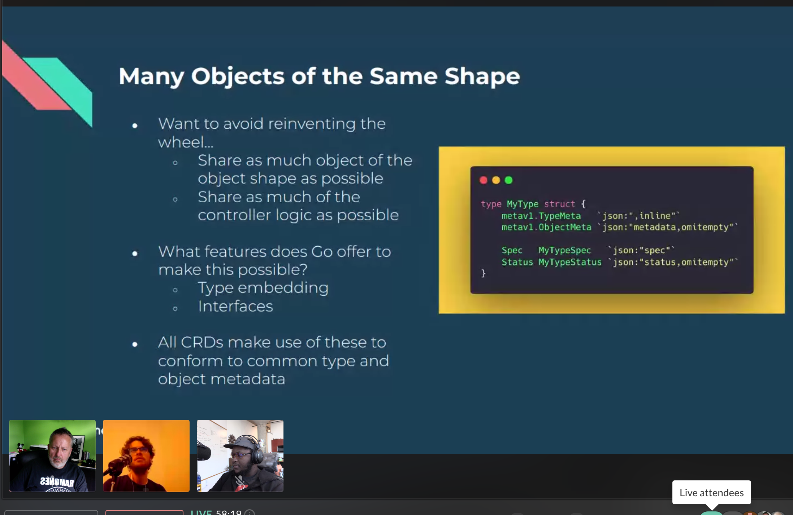
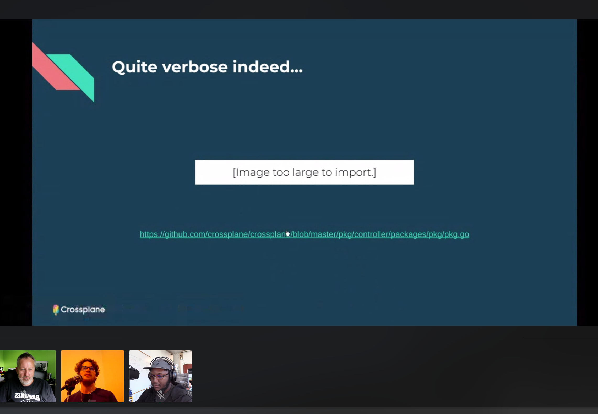

# Writing General Purpose Kubernetes Controllers in Go
https://www.meetup.com/StL-Go/events/270424382/

## Meta 
| | |
| --- | --- |
| **When:** | Wednesday, May 27, 2020 |
| **Where:** | VIRTUAL EVENT, CrowdCast |
| **Presenter:** | Daniel Mangum, [@hasheddan](https://twitter.com/hasheddan) |
| | Mitali Bisht, [@EngrMitaliB](https://twitter.com/engrmitalib) |
| **Group Membership:** | 367 |
| **Total RSVPs:** | 37 |
| **Total Attendance:** | 23 |

## Presentation
As Kubernetes becomes ubiquitous as the operating system for the data-center, organizations are extending the platform to build their own internal PaaS. This generally consists of creating new CustomResourceDefinitions (CRDs) and corresponding controllers to manage them. As a platform grows, it is common for different classes of resources to evolve. For instance, a platform may support provisioning different types of compute resources that each require their own CRD, but are reconciled in very similar ways. Writing new reconcilers with complex logic for every primitive in an infrastructure platform can be cumbersome and error-prone.

Fortunately, making use of common interfaces can make this burden much lighter. In this talk we will explore how to write robust general purpose Kubernetes reconcilers using embedded types, code generation, duck types.

## Presenter
Daniel is a software engineer at Upbound where he works on the open source Crossplane project. He also serves on the Kubernetes release team, and is an active contributor to the Kubernetes project and multiple other open source efforts. He hosts a biweekly live stream show, The Binding Status, focused on extending Kubernetes, building Crossplane, and enabling a multicloud future.

## Lightning Talk
### _Understanding pseudo-versions, moving to Go 1.13 and what is in Go 1.14_

As of Go v1.13 extracting a module from a version control system, the go command performs additional validation on the requested version string, as a result, any module which has multiple pseudo-versions for one commit hash will fail. In this talk, we will explain the version validations that have been enforced with Go v1.13 and how to fix them so that you can upgrade to Go v1.13 seamlessly. This talk will also cover what is new in Go 1.14 for Go module.

### Presenter: Mitali Bisht, @EngrMitaliB
An experienced software engineer, Mitali has designed, developed and led challenging software projects involved cloud technologies, Big data , web ,devops in both large and small tech companies. As a Community Software Engineer at JFrog she is responsible for developing features for Gocenter and other projects related to Community. She has also been engaging with Go Community authors to make them aware of the security aspect of their modules and help them to resolve it. She loves exploring and adopting new technologies.

## Recording
https://www.crowdcast.io/e/20200527-stlgomeetup

## Action Shots
|  |  |
| --- | --- |
|  |  |
|  |  |
|  | |

## Giveaways
Congratulations to our winners of these awesome t-shirts provided by [JFrog](https://jfrog.com/):

| Name | Crowdcast User |
| --- | --- |
| Utkarsh Mani Tripathi | @utkarshmani1997 |
| James | @james5464 |
| David Jacobs | @citeon |

Congratulations to our winners of the $35 USD gift cards for the [CNCF Swag Store](https://store.cncf.io/collections/kubernetes) provided by the [CNCF](https://www.cncf.io/):

| Name | Crowdcast User |
| --- | --- |
| 𝓜𝓪𝓻𝓺𝓾𝓮𝓼 𝓙𝓸𝓱𝓪𝓷𝓼𝓼𝓸𝓷 | @marques5830 |
| Todd | @toddelewis |
