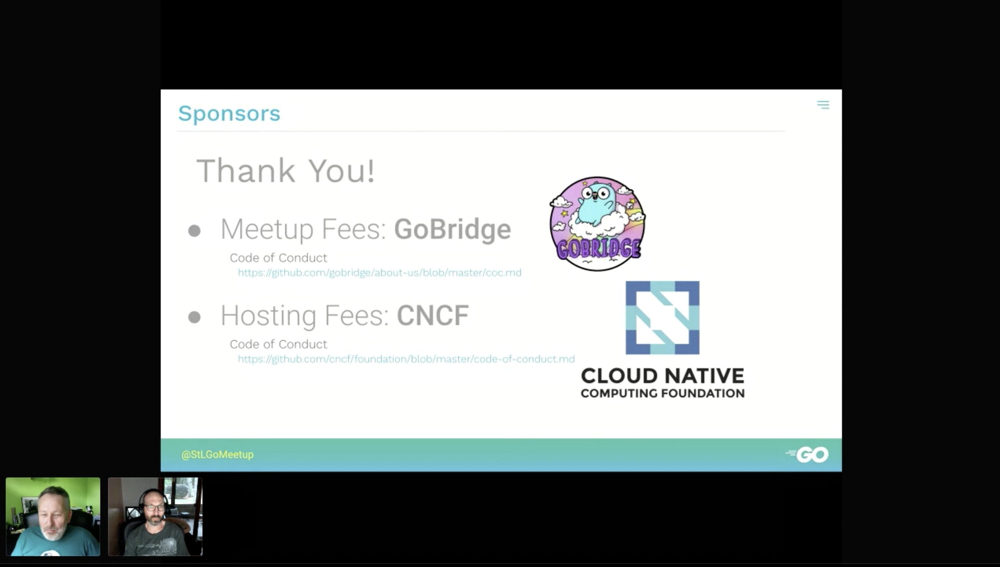
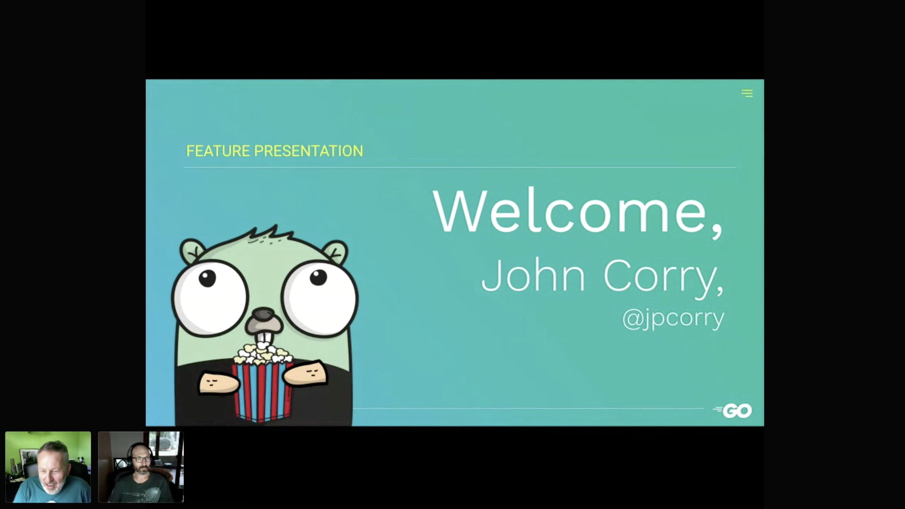
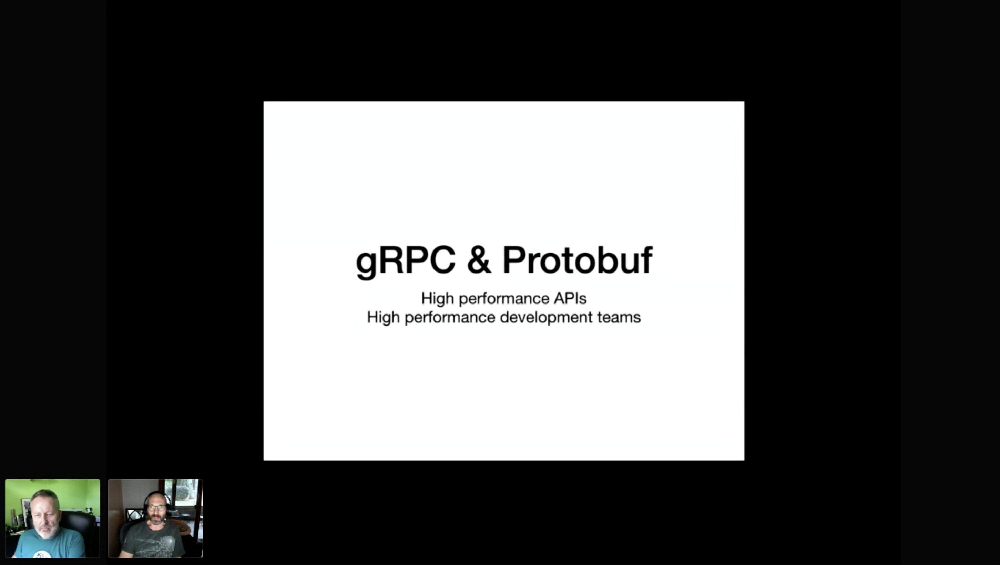
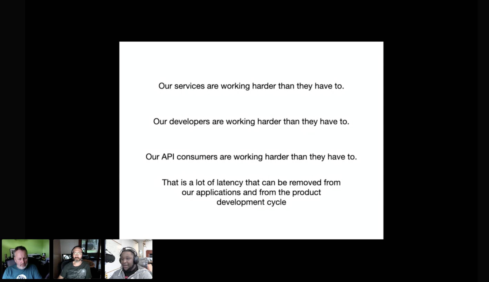
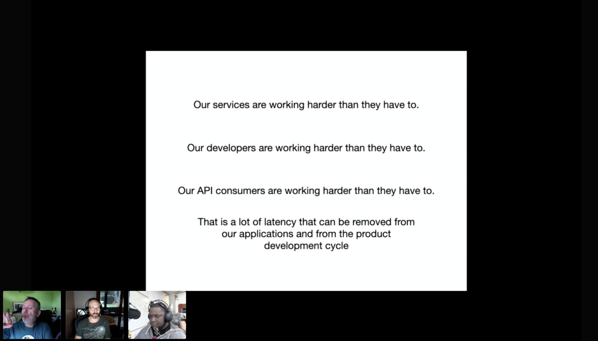
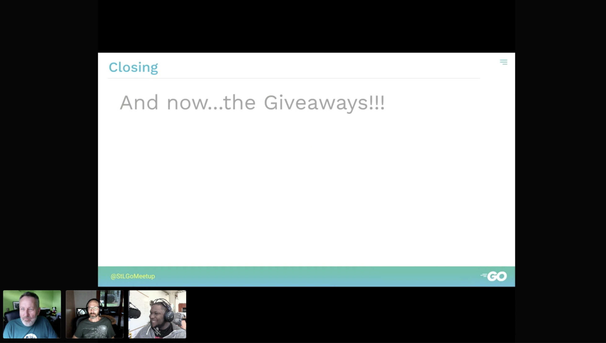

# gRPC & Protobuf: High Performance APIs, High Performance Development Teams
https://www.meetup.com/StL-Go/events/270921500/

## Meta 
| | |
| --- | --- |
| **When:** | Wednesday, June 24, 2020 |
| **Where:** | VIRTUAL EVENT, CrowdCast |
| **Presenter:** | John Corry, [@jpcorry](https://twitter.com/jpcorry) |
| **Group Membership:** | 392 |
| **Total RSVPs:** | 46 |
| **Total Attendance:** | 22 |

## Presentation
gRPC is an incubating project within the Cloud Native Computing Foundation (CNCF). As described on the project website, "gRPC is a modern open source high performance RPC framework that can run in any environment. It can efficiently connect services in and across data centers with pluggable support for load balancing, tracing, health checking and authentication."

## Presenter
John has been building things for the web for a really long time. He's a Go enthusiast and at a point in his career where he realizes the impact we have on each other is of far greater meaning than the contributions we make to systems.

## Recording
https://www.crowdcast.io/e/20200624-stlgomeetup

## Action Shots
|  |  |
| --- | --- |
|  |  |
|  |  |
|  |  |

## Giveaways
Congratulations to our winners of the $35 USD gift cards for the [CNCF Swag Store](https://store.cncf.io/collections/kubernetes) provided by the [CNCF](https://www.cncf.io/):

| Name | Crowdcast User |
| --- | --- |
| Siva Sareddu | @user8f86d050 |
| Rudy | @user86ca40f2 |
