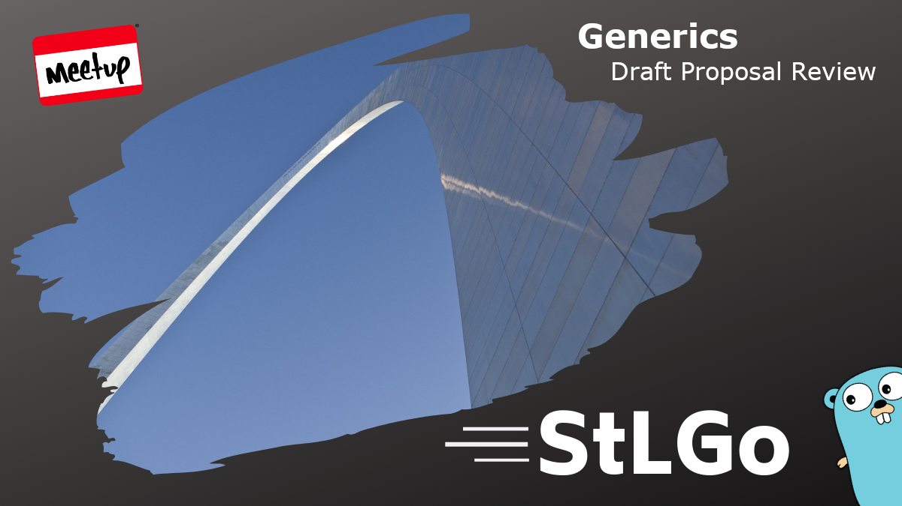
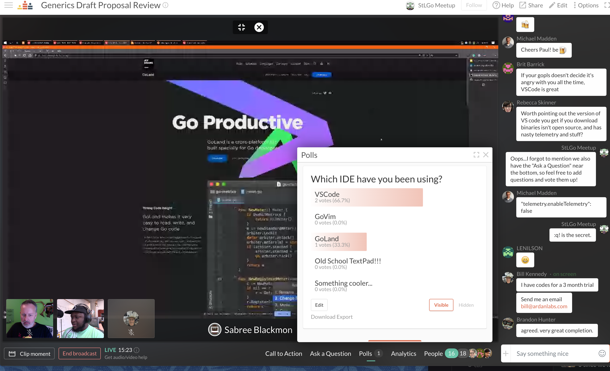
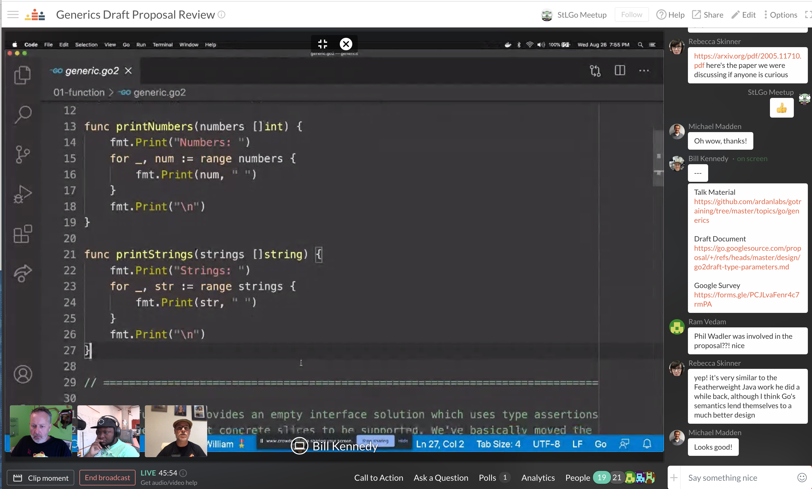
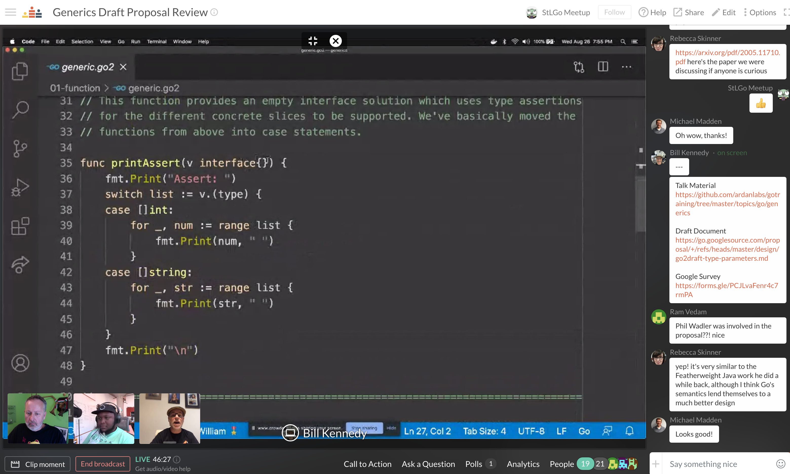
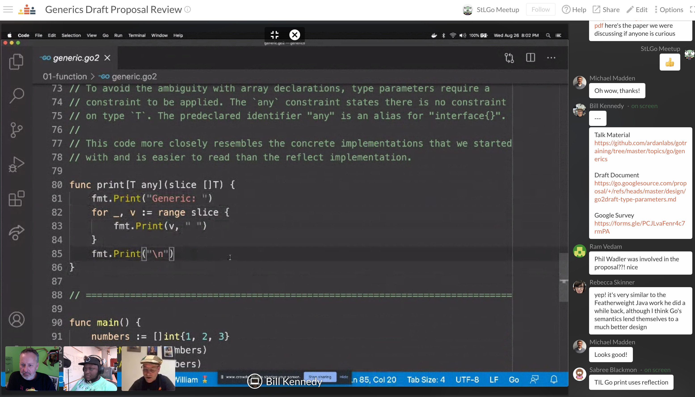
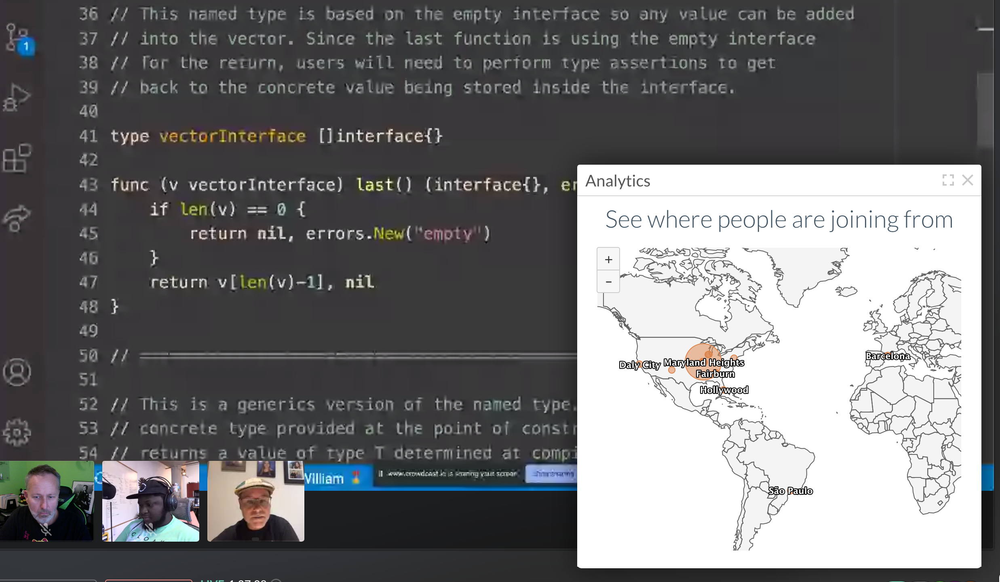
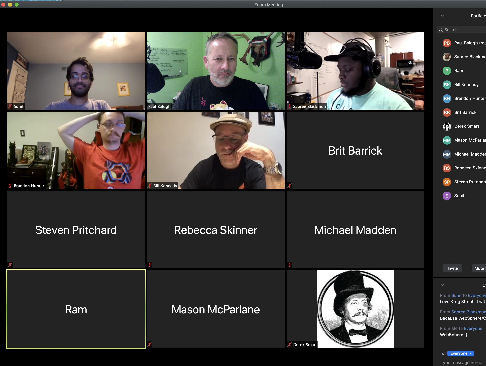

# Generics Draft Proposal Review
https://www.meetup.com/StL-Go/events/272446868/

## Meta 
| | |
| --- | --- |
| **When:** | Wednesday, August 26, 2020 |
| **Where:** | VIRTUAL EVENT, CrowdCast/Zoom |
| **Presenter:** | Bill Kennedy, [@goinggodotnet](https://twitter.com/goinggodotnet) |
| | Sabree Blackmon, [@HeavyPackets](https://twitter.com/HeavyPackets) |
| **Group Membership:** | 421 |
| **Total RSVPs:** | 47 |
| **Total Attendance:** | 22 |

## Presentation
With the release of the new draft proposal for generics, Go inches closer to having a version of generics in the language. It's important that the community as a whole agrees this new language feature "feels" like Go and will add value to the language and the applications we build.

In this talk, Bill Kennedy will review the major aspects of the draft proposal with code samples. He will spend time teaching different aspects of the new syntax and show how generics can help make Go programs more readable when it's reasonable and practical to use generics. After the presentation we'll ask questions to the group to get feedback and opinions.

## Lightning Talk
### _Go: IDE Rundown_
Let's review the current state of Go development environments.

## Recording
https://www.crowdcast.io/e/20200826-stlgomeetup

## Action Shots
|  |  |
| --- | --- |
|  |  |
|  |  |
|  |  |

## Giveaways
None sadly :cry: Due to our session being cut short, we weren't able to provide the giveaway for 4 1-year licenses of GoLand.

## Happenings
This session was full of post-presentation discussion which caused us to hit our time-limit. The transition to an extended session didn't go so smoothly, but we quickly decided Zoom would make for easier group discussion, allowing everyone to ask questions audibly. 