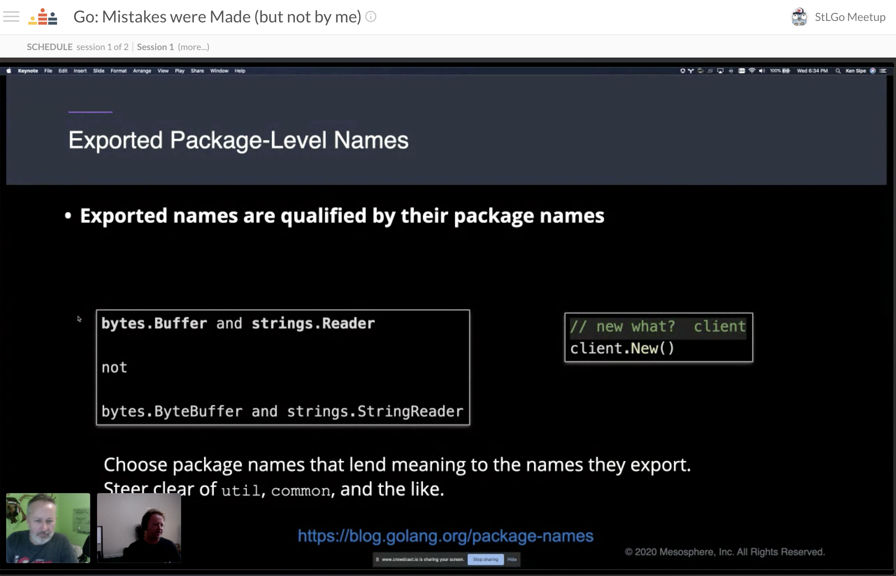

# Go: Mistakes were Made (but not by me)
https://www.meetup.com/StL-Go/events/272850932/

## Meta 
| | |
| --- | --- |
| **When:** | Wednesday, September 23, 2020 |
| **Where:** | VIRTUAL EVENT, Crowdcast |
| **Presenter:** | Ken Sipe, [@kensipe](https://twitter.com/kensipe) |
| **Group Membership:** | 435 |
| **Total RSVPs:** | 36 |
| **Total Attendance:** | 17 |

## Presentation
Go can be a hyper-productive language to develop in, but like most languages, has it's bad and good parts. Just like what JavaScript: The Good Parts did for JavaScript and Effective Java did for Java, there are nuances/gotchas to navigate in Go. This session walks through a number of ways you can do it wrong with appropriate solutions.

This session will walk through:
* Go best practices
* Go common mistakes
* Making your life easier with golangci-lint linting

## Presenter
Ken Sipe is a Distributed Application Engineer at D2iQ working on the Orchestration team. Ken is a committer on the CNCF sandbox projects KUDO and KUTTL, working to improve the Kubernetes experience. Ken is an internationally recognized speaker, receiving the Top Speaker and JavaOne Rockstar awards in 2009, and continues to speak and be an internationally renowned leader on such topics as distributed application development, micro-service based architectures, web application security, and software engineering best practices.

## Links
[Ken's Repo for the talk](https://github.com/codementor/go-mistakes)

## What's Paul Drinking?
Oktoberfest Märzen Lager from [Mother's Brewing Company](https://www.mothersbrewing.com/), Springfield, MO

## Recording
https://www.crowdcast.io/e/20200923-stlgomeetup

## Action Shots
|  |  |
| --- | --- |
|  |  |
|  |  |
|  |  |

## Giveaways
Congratulations to our winners for the five (5) 1-yr. JetBrains Product Licenses provided by [JetBrains](https://www.jetbrains.com/). While you can use them for _any_ JetBrains product, we are bit partial to [GoLand](https://www.jetbrains.com/go/)!
