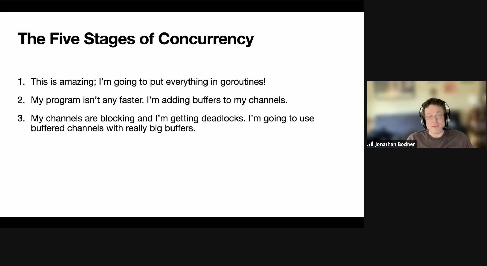

# Concurrency: When and How to Use It

## Meta 
| | |
| --- | --- |
| **When:** | Wednesday, April 28, 2021 |
| **Where:** | VIRTUAL EVENT, Zoom/YouTube |
| **Presenter:** | Jon Bodner, [@jonbodner](https://twitter.com/jonbodner) |
| **Group Membership:** | 478 |
| **Total RSVPs:** | 41 |
| **Total Attendance:** | 19 |

## Presentation
Concurrency is one of the signature features of Go, one of the things that even non-Go developers have heard about. However, just because Go makes it easy to launch concurrent processes, that doesn’t mean that it’s easy to use concurrency properly. In this talk, Jon Bodner covers the basics of concurrency, when to use it, and some of the patterns to follow when you need it. We’ll also take a quick look at mutexes, when they are appropriate, and their limitations.

## Presenter
Jon Bodner has been a software engineer, lead developer and architect for over 20 years. In that time, he has worked on software across many fields, including education, finance, commerce, healthcare, law, government, and internet infrastructure.

Jon is a Distinguished Engineer at Capital One, where he has contributed to their development and testing workflow, developed patented techniques for web payment page detection and population, and co-authored tools for finding and managing software development issues.

Jon is a frequent speaker at Go conferences, and his blog posts on Go and software engineering have been viewed more than 300,000 times. He is the creator of the Proteus data access library (https://github.com/jonbodner/proteus) and co-developer of checks-out, a fork of the LGTM project (http://github.com/capitalone/checks-out).

## Resources
[Meeting Intro](Meeting-Intro.pdf)

## What's Paul Drinking?
*Surfside Pineapple Wheat* from [Chandeleur Island Brewing Company](https://chandeleurbrew.com/), Gulfport, MS.

## Recording
https://youtu.be/FDHbnHLdvNw

## Action Shots
|  |  |
| --- | --- |
|  |  |
|  |  |
|  |  |

## Giveaways
Congratulations to _Scott Anderson_, _Francis Alaphat_, and _Ray Bednara_!  Each was winner of a copy of our presenter's book, [Learning Go](https://www.oreilly.com/library/view/learning-go/9781492077206/) provided by [O'Reilly](https://www.oreilly.com/).

## Other
Special shout-out to [Bossman](https://bossmanbrand.com/) for keeping hold of [Paul's mustache](https://twitter.com/javaducky) with [MUDstache®](https://bossmanbrand.com/products/mustache-wax) during the session.
