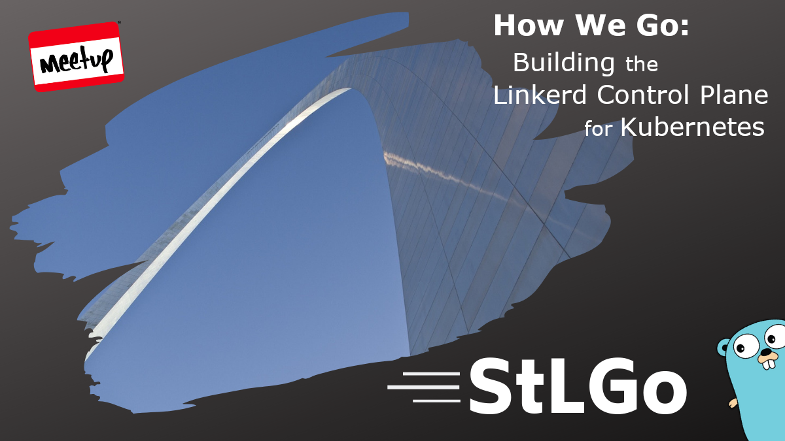

# How We Go: Building the Linkerd Control Plane for Kubernetes

## Meta 
| | |
| --- | --- |
| **When:** | Wednesday, May 26, 2021 |
| **Where:** | VIRTUAL EVENT, Zoom/YouTube |
| **Presenter:** | Charles Pretzer, [@charpretz](https://twitter.com/charpretz) |
| **Group Membership:** | 483 |
| **Total RSVPs:** | 12 |
| **Total Attendance:** | 5 |

## Presentation
In 2017, the maintainers of the Linkerd service mesh decided to redesign Linkerd 2 with a focus on simplicity and performance. Go quickly made the short list of languages that were considered for the redesign and this talk focuses on the factors that resulted in selecting Go for the Linkerd control plane. We'll also look closely at how the Linkerd control plane uses the workqueue feature of the client-go package to efficiently handle events dispatched by Kubernetes.

## Presenter
Charles Pretzer is a field engineer at Buoyant, where he spends his time collaborating and engaging with the open source community of the CNCF service mesh, Linkerd. He also enables production adoption by helping companies integrate Linkerd into their Kubernetes based applications. Charles has spoken at meetups and conferences hosted by ABN Amro, Macnica, and NGINX Conf. When he's not presenting or in front of a computer, he's riding a motorcycle or making a delicious mess in the kitchen.

## Resources
[Meeting Intro](Meeting-Intro.pdf)

## What's Paul Drinking?
*Schlafly Berry Brunch Stout* from [Schlafly Beer](https://www.schlafly.com/), St. Louis, MO.

## Recording
https://youtu.be/EgtRR095lEU

## Giveaways
We didn't have a live "quorum" for the giveaways, so we're going to try something on Twitter possibly.
