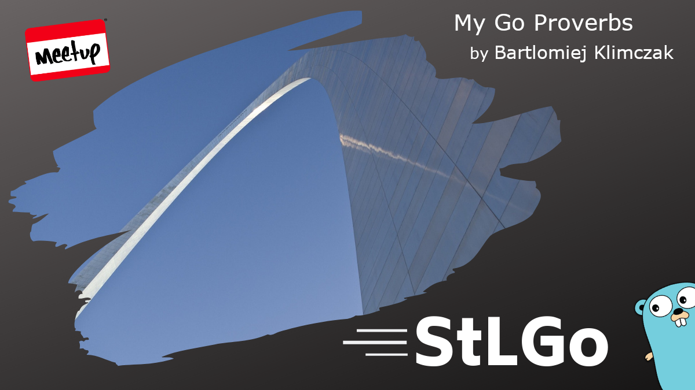

# My Go Proverbs

## Meta 
| | |
| --- | --- |
| **When:** | Wednesday, October 27, 2021 |
| **Where:** | VIRTUAL EVENT, Zoom/YouTube |
| **Presenter:** | Bartłomiej Klimczak, [@kabanek](https://twitter.com/kabanek) |
| **Group Membership:** | 502 |
| **Total RSVPs:** | 19 |
| **Total Attendance:** | 6 |

## Presentation
After almost five years of working with Go projects on the production, I noticed some patterns that work while building business applications in Go. In the talk, I'll share with you my general guidance and good practices I was able to work out.

## Resources
[Meeting Intro](Meeting-Intro.pdf)

We mentioned the mentoring platform video available at https://www.youtube.com/watch?v=nXJX2FyeMv0.

## What's Paul Drinking?
*Miller Lite* from [Miller Brewing Co.](https://www.millerlite.com/), Milwaukee, WI.

## Recording
https://youtu.be/LE1UfpA48zY

## Chat Transcript

18:58:19 From Bartek Klimczak to Everyone:
	https://medium.com/@_orcaman/when-too-much-concurrency-slows-you-down-golang-9c144ca305a

19:14:51 From Jerrod Early to Everyone:
	this was great, practical advice for trying to be idiomatic in your coding :)  (I love the go mantra of idiomatic code)

19:16:05 From zach to Everyone:
	was a good talk

19:19:45 From zach to Everyone:
	thank you!
