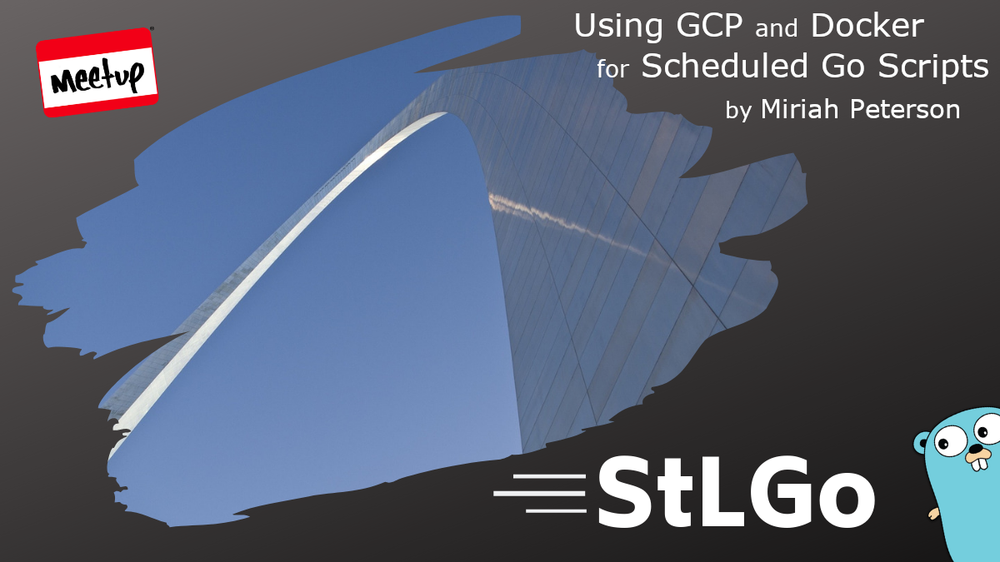

# Using GCP and Docker for Schedule Based Go Scripts

## Meta 
| | |
| --- | --- |
| **When:** | Wednesday, November 10, 2021 |
| **Where:** | VIRTUAL EVENT, Zoom/YouTube |
| **Presenter:** | Miriah Peterson, [@captainnobody1](https://twitter.com/captainnobody1) |
| **Group Membership:** | 511 |
| **Total RSVPs:** | 19 |
| **Total Attendance:** | 7 |

> Happy 12th birthday to the Go language!!!

## Presentation
Sometimes we need our apps to run via Cron style scheduling. In this talk we will explore using Cloud Run and docker images to run a cron style go app.

## Presenter
Currently a Data Engineer at Weave in Lehi, Utah, Miriah focuses on scaling data infrastructure platforms and pipelines. Sharing knowledge and experiences is a focus Miriah’s career. She has given many talks on machine learning, data engineering, and data architecture strategy. Additionally she works in the community as a board member for the Forge Foundation Inc and organizer of GoWest Conference, WomenWhoGo Utah meetup, and Machine Learning Utah meetup.

## Resources
* [Meeting Intro](Meeting-Intro.pdf)
* [Chat Transcript](chat-transcript.txt)
* [Presenter Slides](https://github.com/Soypete/talks/tree/master/go-run-gcp)

## What's Paul Drinking?
*Blackberry Weiss* from [Missouri Beer Company](https://mobeerco.com/), O'Fallon, MO, poured from a killer [Mini Keg Growler](https://www.amazon.com/dp/B08ZMN9H92?psc=1&ref=ppx_yo2_dt_b_product_details).

## Recording
https://youtu.be/k_VvenrOHkk

## Giveaways
Congratulations to _Charo Nuguid_! Charo was our winner for a downloadable copy of [For the Love of Go](https://bitfieldconsulting.com/books/love) by [John Arundel](https://twitter.com/bitfield) provided by [Bitfield Consulting](https://bitfieldconsulting.com/).
