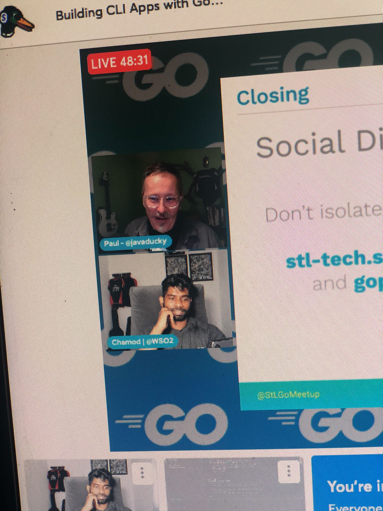

# Building CLI Apps with Golang

## Meta 
| | |
| --- | --- |
| **When:** | Wednesday, February 23, 2022 |
| **Where:** | VIRTUAL EVENT, YouTube/Twitch |
| **Presenter:** | Chamod Shehanka Perera, [@chamodshehanka](https://twitter.com/chamodshehanka) |
| **Group Membership:** | 557 |
| **Total RSVPs:** | 52 |
| **Total Attendance:** | 9 YouTube, 2 Twitch |

## Presentation
This talk will cover how to develop command-line applications in Go. Included will be a demo focusing on areas of Go’s CLI features. All CLI Ops tools (Re) Written in Go, Ops tools written in Go. During the demo, I am planning to build an application to show Golang CLI features.

## Presenter
Chamod Shehanka Perera is a Software Engineer at WSO2 and he is an open source enthusiast who has a degree in software engineering from Sri Lanka Institute of Information Technology. Interested in conducting tech talks in domains such as open-source contribution, he has lead FOSS Community of SLIIT as the President for 2021/22. He is a Co-Lead of Golang Sri Lanka, StackOverflow Sri Lanka, and GitHub Community Sri Lanka.

## Resources
* [Meeting Intro](Meeting-Intro.pdf)
* [Presenter Slides](Building\%20CLI\%20Apps\%20with\%20Golang-2.pdf)

## What's Paul Drinking?
*Boulevard Tart Apple Radler* from [Boulevard Brewing Company](https://www.boulevard.com/), Kansas City, MO.

## Recording
https://youtu.be/ez1j4a5dfxs

## Action Shots
|  |  |
| --- | --- |
|  |  |
|  |  |
|  |  |
