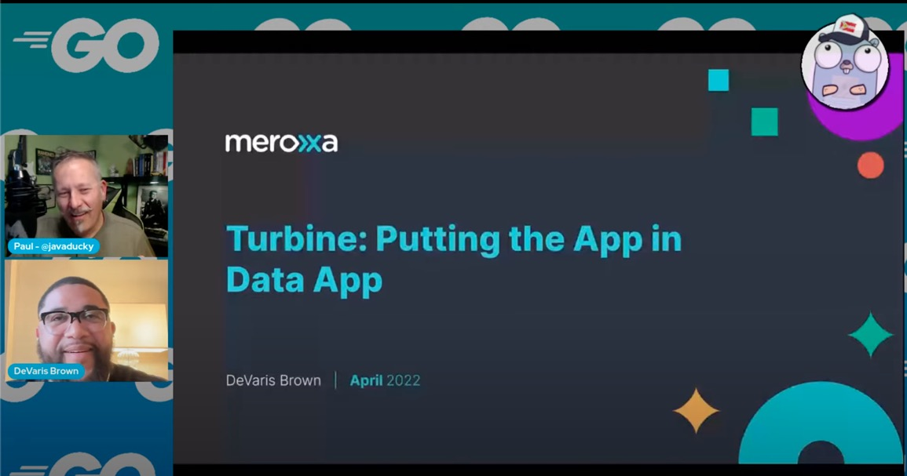
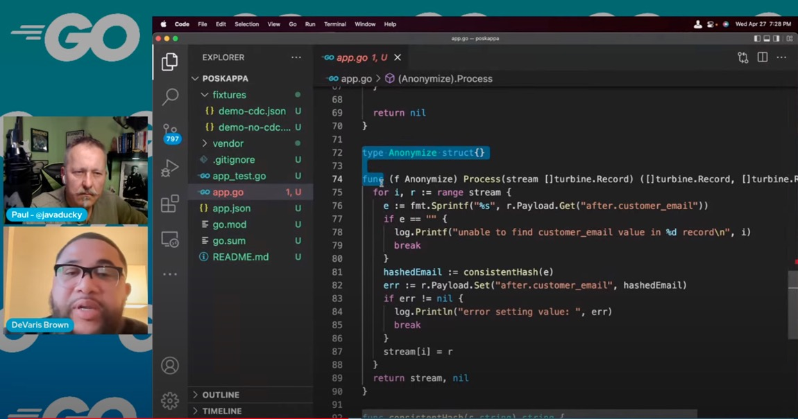
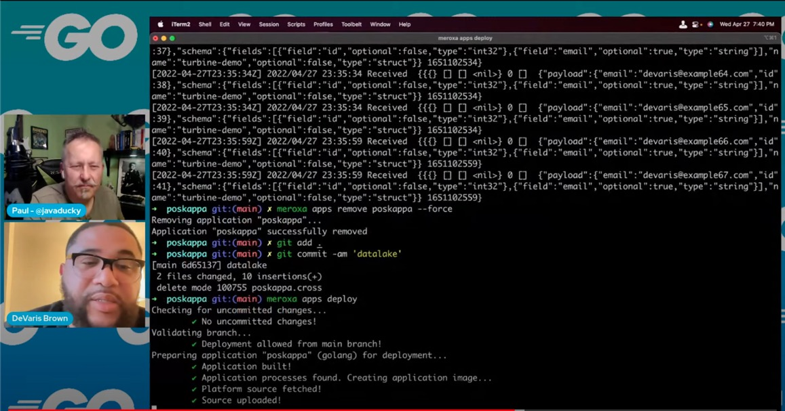
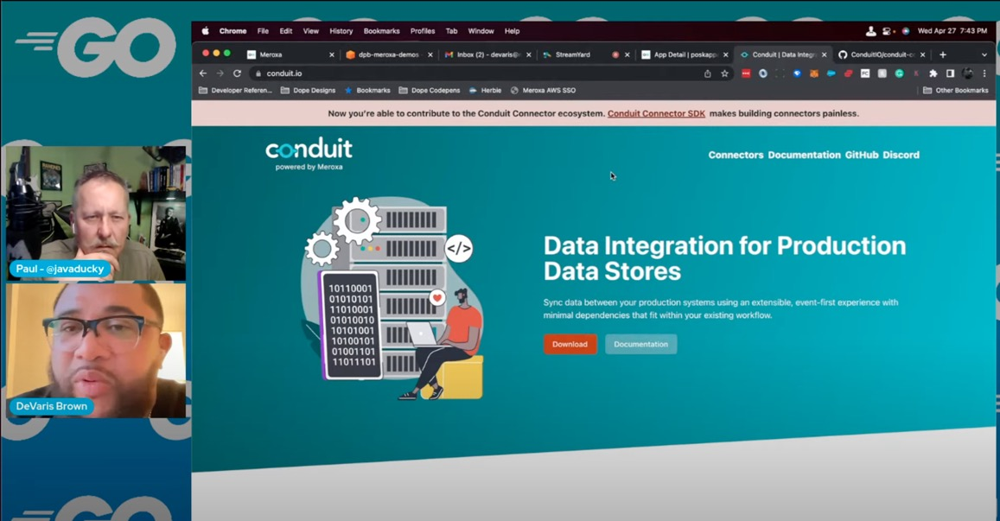

# Building Real-Time Data Apps with Go and Turbine

## Meta 
| | |
| --- | --- |
| **When:** | Wednesday, April 27, 2022 |
| **Where:** | VIRTUAL EVENT, YouTube/Twitch |
| **Presenter:** | DeVaris Brown, [@devarispbrown](https://twitter.com/devarispbrown) |
| **Group Membership:** | 586 |
| **Total RSVPs:** | 30 |
| **Total Attendance:** | 3 YouTube, 2 Twitch |

## Presentation
Before Turbine, real-time data apps required expert knowledge in multiple systems(Kafka, Kafka Connect, Docker, Zookeeper, k8s, Airflow, Spark) and to stand up multiple environments for testing and production. Now with Turbine, you can create data apps with idiomatic Go without worrying about configuring and operating complex distributed systems.

## Presenter
DeVaris is the CEO and co-founder of Meroxa, a VC backed company enabling teams of any size and level of expertise to build real-time data applications in minutes not months. Prior to founding Meroxa, DeVaris was a product leader at Twitter, Heroku, VSCO, and Zendesk. When he’s not sitting in front of a computer, you can find DeVaris behind a camera capturing moments in time, at the stove whipping up the finest delicacies, or behind a set of turntables, moving a sea of people through music.

## Resources
* [Meeting Intro](Meeting-Intro.pdf)

## What's Paul Drinking?
*Lone Star Beer* from [Lone Star Brewing Company](https://www.lonestarbeer.com/), Fort Worth, TX.

## Recording
https://youtu.be/KryLiR6F4D4

## Action Shots
|  |  |
| --- | --- |
|  |  |
|  |  |
|  |  |
