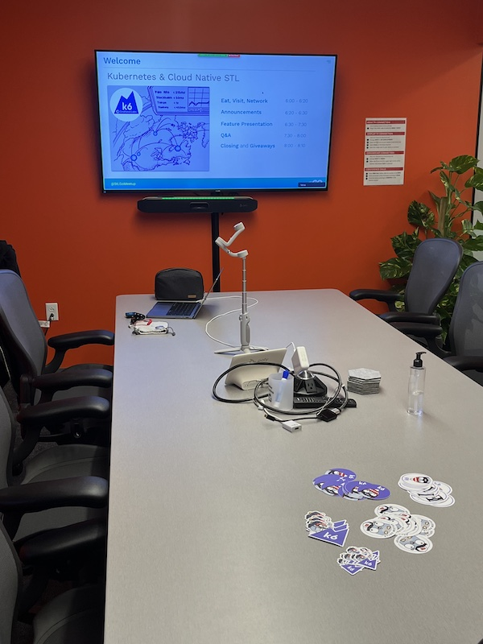
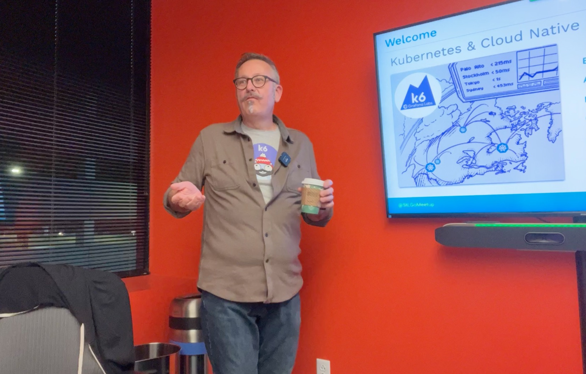
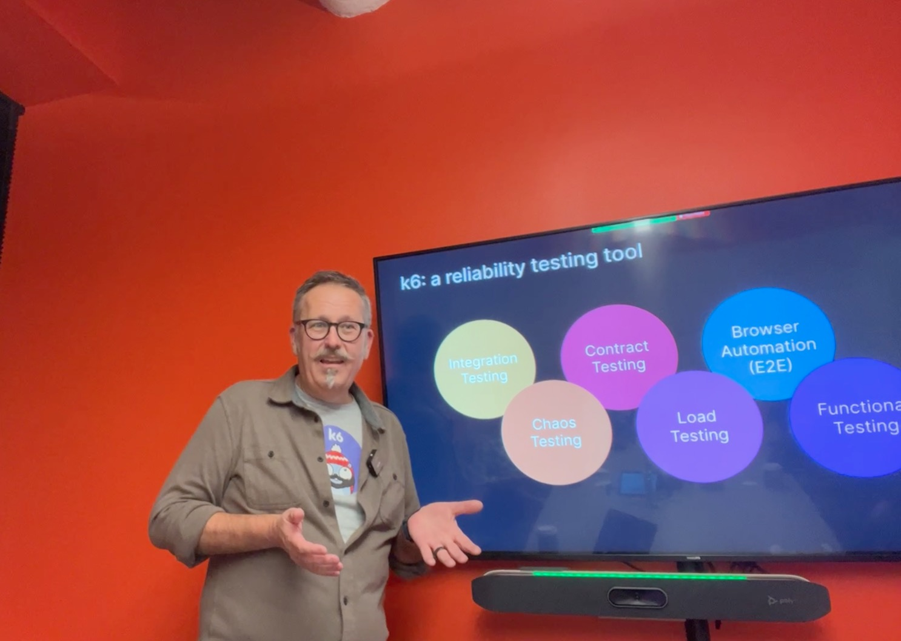
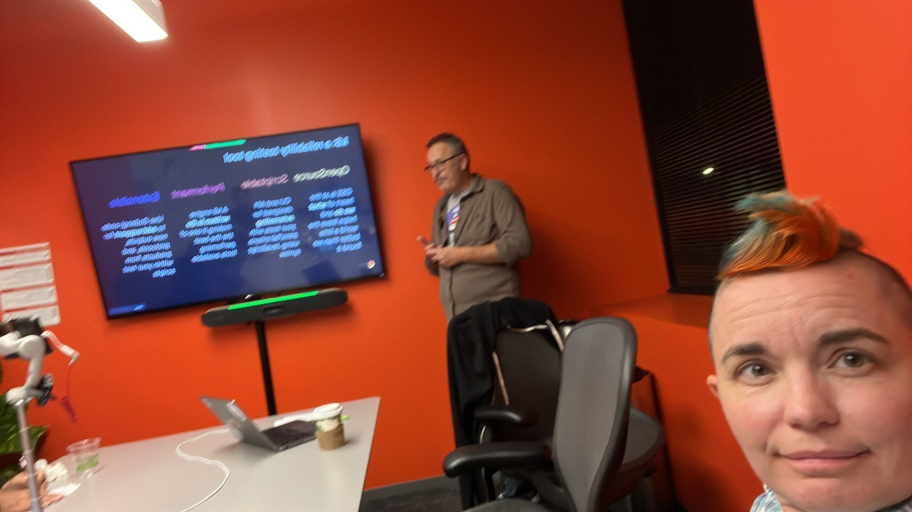
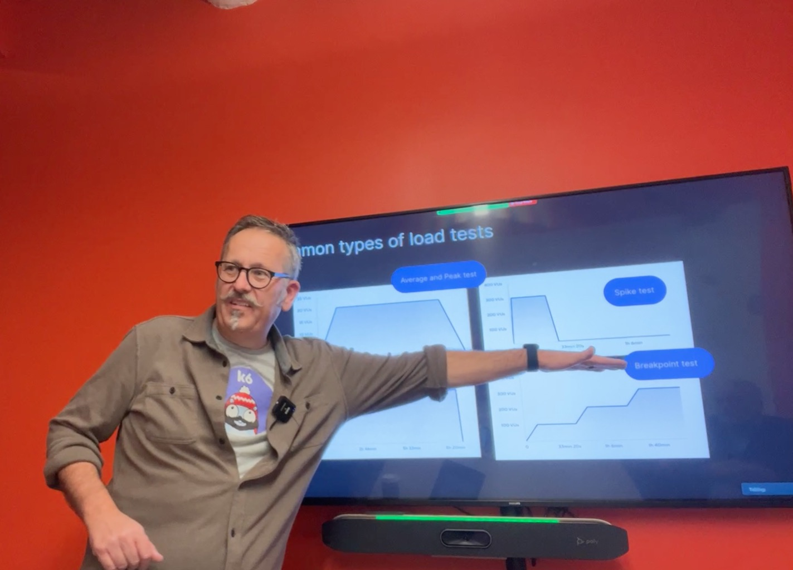
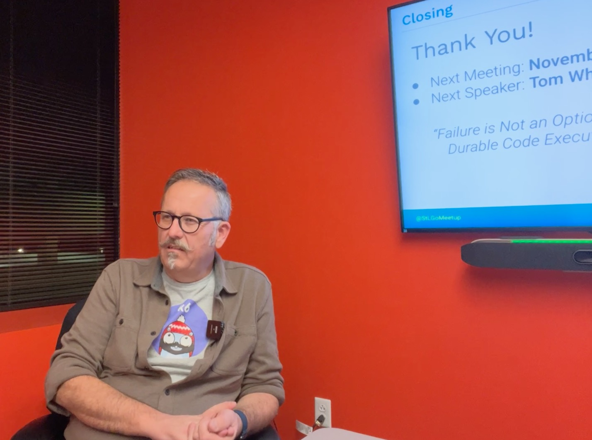

# Running distributed load tests with k6

## Meta 
| | |
| --- | --- |
| **When:** | Thursday, October 20, 2022 |
| **Where:** | 4220 Duncan Ave - St. Louis, MO 63110 |
| **Presenter:** | Paul Balogh, [@javaducky](https://twitter.com/javaducky) |
| **Hosting Group:** | Kubernetes &amp; Cloud Native STL |
| **Group Membership:** | 411 |
| **Total RSVPs:** | 13 |
| **Total Attendance:** | 6 |

## Presentation
Observability and CI/CD are must-haves in cloud-native environments. At their core, both are about enabling humans and machines to understand their code and workloads more deeply. Reliability testing should be part of CI/CD feeding into your observability stack, but until recently, there were mainly paid download or SaaS solutions on the market.

[Grafana's k6](https://k6.io/) reliability testing tool allows you to load test your applications, validate your API contracts, and perform end-to-end browser tests. With [k6-operator](https://github.com/grafana/k6-operator), you can now run distributed tests within your Kubernetes cluster.

We will walk through setting up a k6-operator, how to configure your tests using JavaScript, and how to visualize the results in Grafana alongside your real-world production data.

## Presenter
[Paul Balogh](https://www.linkedin.com/in/pabalogh/) works at Grafana Labs as a k6 Developer Advocate working with the Go development community building k6 Extensions.

## Event
The basic agenda follows:
* 6:00 - 6:20 Food and networking (Go excels at networking).
* 6:20 - 6:30 Announcements, intros, and so forth.
* 6:30 - 7:30 Main presentation of the month.
* 7:30 - 8:00 Q&A

Please join us for this **in-person event** in Cortex! **_Please, be sure to RSVP so that we can plan the food appropriately as well as scheduling ample meeting space._** Your help in this is greatly appreciated as we try to ensure the safety and comfort of those attending.

## Sponsors
* **Meetup Fees** covered by [CNCF](https://www.cncf.io/).
* **Facilities** provided by [Cambridge Innovation Center (CIC)](https://cic.com/). If signing up for coworking space, tell them _Paul Balogh_ sent you!
* **Food** from [Fortels Pizza Den](https://www.fortelspizzaden.com/) provided by [Grafana Labs](https://grafana.com/).
* **Giveaways** provided by [k6](https://k6.io/).

## Resources
* [Meeting Intro](Meeting-Intro.pdf)
* [Presenter Slides](Running%20distributed%20tests%20with%20k6.pdf)
* [Demo project](https://github.com/javaducky/demo-k6-operator)

### From other k6 discussions...
* [k6 Contract Testing example](https://github.com/grafana/k6-example-api-contract-validation) - a how-to for contract testing
* [k6 Chaos](https://github.com/grafana/k6-chaos) - JS library using the [xk6-kubernetes](https://github.com/grafana/xk6-kubernetes) extension to "spice up" your life in Kubernetes by adding a little chaos

### Other stuff overheard or used at the meeting
* [k3d](https://k3d.io/) - Run a Kubernetes cluster within Docker
* [k3s](https://k3s.io/) - *Lightweight* Kubernetes distribution
* [k9s](https://k9scli.io/) - Terminal-based dashboard for inspecting Kube clusters
* [OTel Unplugged @ KubeCon 2022](https://www.eventbrite.com/e/otel-unplugged-kubeconcloudnativecon-detroit-2022-tickets-427595037267) - Extracurriculur event for KubeCon attendees

## Recording
https://youtu.be/wv2jq8rS-mk

## Action Shots
|  |  |
| --- | --- |
|  |  |
|  |  |
|  |  |

## Miscellaneous Credits
* [Golang Stranger Things image in video](https://wallpaperaccess.com/golang)
