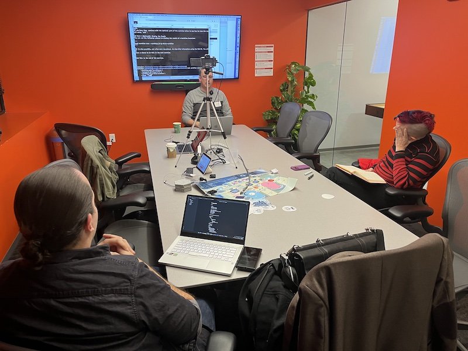

# Failure is Not an Option: Durable Code Execution with Temporal

## Meta 
| | |
| --- | --- |
| **When:** | Wednesday, November 16, 2022 |
| **Where:** | 4220 Duncan Ave - St. Louis, MO 63110 |
| **Presenter:** | Tom Wheeler, [@TemporalTom](https://twitter.com/TemporalTom) |
| **Group Membership:** | StLGo: 602, KCN-STL: 425 |
| **Total RSVPs:** | StLGo: 9, KCN-STL: 14 |
| **Total Attendance:** | 4 |

## Presentation
As applications move away from monolithic architectures, developers have increasingly become distributed systems engineers, though not all of them recognize it yet. The increased scalability and flexibility comes at the cost of reliability. Attempting to address the inherent challenges of distributed systems, developers often write code to deal with failures, timeouts, and retries, which distracts them from the core business logic and results in systems that are more complex and difficult to maintain. Temporal is an open source system that offers durable execution of your code, which removes the complexity from your applications while also ensuring they're reliable despite inevitable failures of the systems and infrastructure on which those applications depend.

During this talk, Tom will explain the basic architecture and core concepts of Temporal, as well as demonstrate how to create and run a Temporal application written in Go.

## Presenter
Alternating between software engineering and technical education roles, Tom Wheeler's career spans more than 25 years in the financial, healthcare, aerospace, and tech industries. Prior to joining Temporal, he created and taught training courses at Cloudera, developed engineering software at Boeing while consulting for Object Computing, Inc. (OCI), helped design and implement a high-volume data processing system for WebMD, and wrote code for some of the earliest web applications at A.G. Edwards. Tom enjoys learning new things and teaching them to others, which has led to presentations at several conferences, including Strange Loop, OSCON, and JavaOne. When Tom manages to step away from the computer, you can probably find him cooking, traveling, or playing guitar.

## Event
The basic agenda follows:
* 5:30 - 6:00 Food and networking (Go excels at networking).
* 6:00 - 6:10 Announcements, intros, and so forth.
* 6:15 - 7:00 Main presentation of the month.
* 7:00 - 7:30 Q&A

Please join us for this in-person event in Cortex! Please, be sure to RSVP so that we can plan the food appropriately as well as scheduling ample meeting space. Your help in this is greatly appreciated as we try to ensure the safety and comfort of those attending.

## Sponsors
* **Meetup Fees** covered by [GoBridge](https://github.com/gobridge/).
* **Facilities** provided by [Cambridge Innovation Center (CIC)](https://cic.com/). If signing up for coworking space, tell them _Paul Balogh_ sent you!
* **Food** from [Imo's Pizza](https://www.imospizza.com/) provided by [Temporal Technologies](https://temporal.io/).

## Resources
* [Meeting Intro](Meeting-Intro.pdf)
* [Demo Cluster Setup](https://github.com/temporalio/docker-compose)

## Recording
https://www.youtube.com/watch?v=IjCqIz-Y5so

## Action Shots
|  |  |
| --- | --- |
|  |  |
