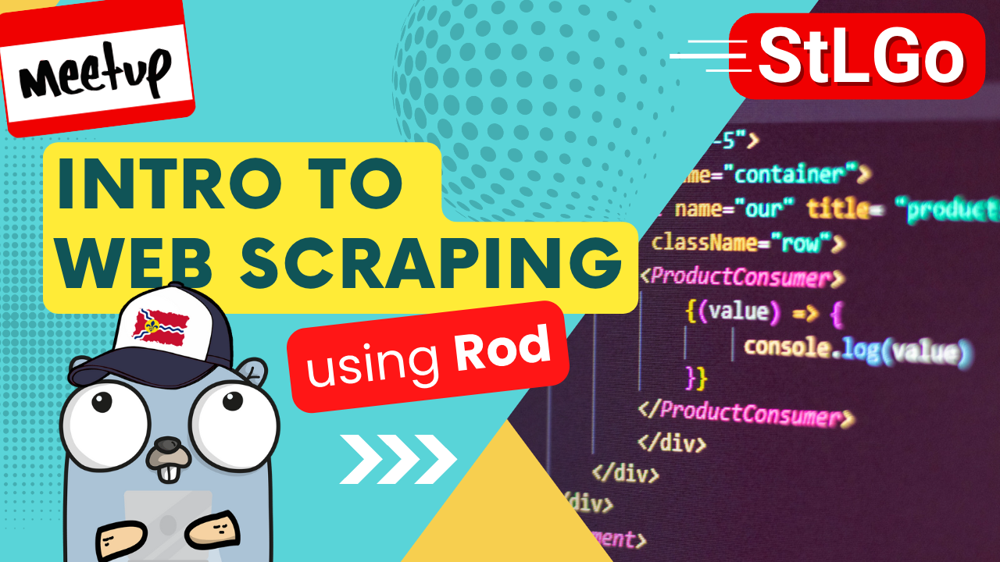
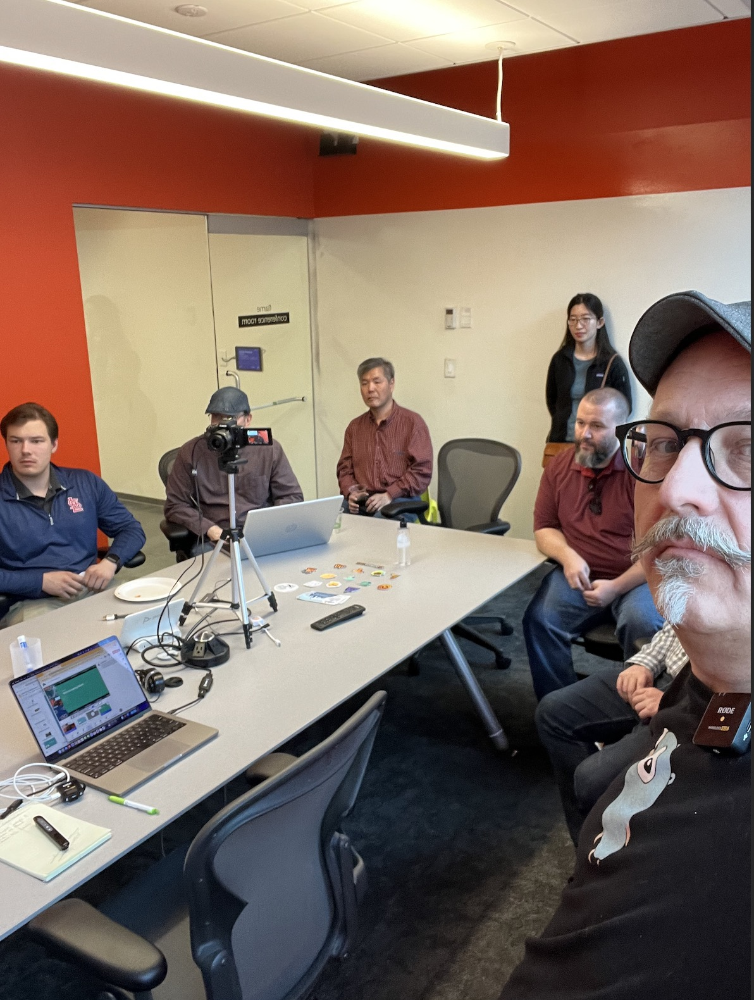

# Intro to Web Scraping in Go

## Meta 
| | |
| --- | --- |
| **When:** | Wednesday, April 26, 2023 |
| **Where:** | [Cambridge Innovation Center (CIC)](https://cic.com/), 4220 Duncan Ave - St. Louis, MO 63110 |
| **Presenter:** | Nathan Nutter |
| **Hosting Group:** | StLGo |
| **Group Membership:** | 643 |
| **Total RSVPs:** | 14 |
| **Total Attendance:** | 11 |

## Presentation
An introduction to the fundamentals of web scraping in Go from minimal HTML parsing up to driving a browser using [Rod](https://github.com/go-rod/rod).

StLGo member Nathan Nutter works for the [St. Louis Cardinals](https://www.mlb.com/cardinals). A long time Go developer, Nathan was able to introduce the use of the Go programming language into the organization.

## Event
The basic agenda follows:
* 5:30 - 6:00 Food and networking (Go excels at networking).
* 6:00 - 6:10 Announcements, intros, and so forth.
* 6:15 - 7:00 Main presentation of the month.
* 7:00 - 7:30 Q&A

Please join us for this **in-person event** in Cortex! **_Please, be sure to RSVP so that we can plan the food appropriately and schedule ample meeting space._** We greatly appreciate your help as we try to ensure the safety and comfort of those attending.

## Sponsors
* **Meetup Fees** covered by [GoBridge](https://github.com/gobridge/).
* **Location Fees** covered by [Grafana Labs](https://grafana.com/). If signing up for coworking space, tell them _Paul Balogh_ sent you so we can get discounts!
* **Food** from [Pizza Hut](https://www.pizzahut.com/) provided by [Grafana Labs](https://grafana.com/).
* **Giveaways** provided by [Tracetest.io](https://tracetest.io/).

## Resources
* [Meeting Intro](Meeting-Intro.pdf)
* [Presenter Slides](Intro%20to%20Web%20Scraping%20in%20Go.pdf)
* [Demo Project](https://github.com/nnutter/intro-to-web-scraping-in-go)

## Recording
https://youtube.com/live/2uf-iz-jpnA

## Action Shots
|  |  |
| --- | --- |
|  |  |
