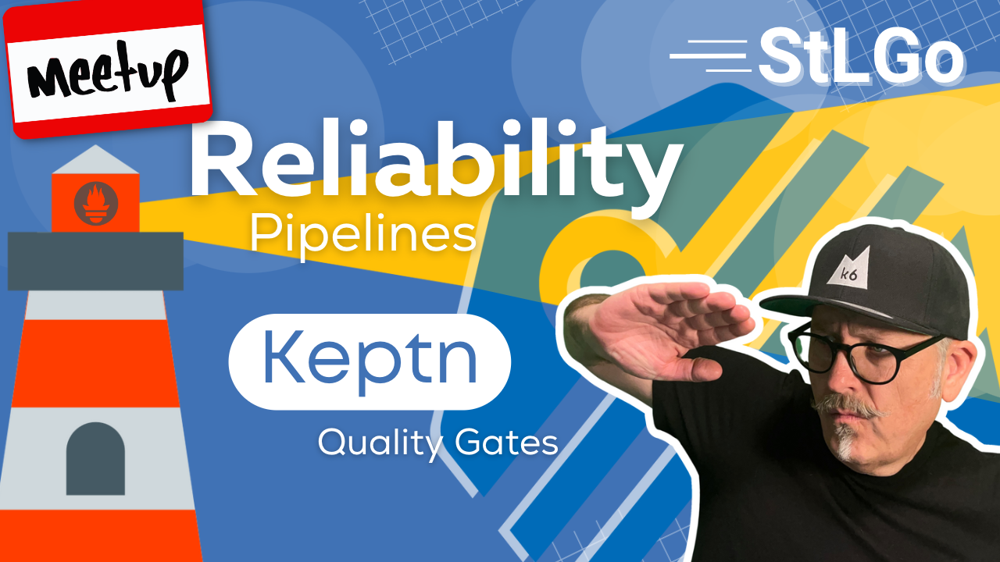

# Creating Reliability Pipelines With Keptn Quality Gates

## Meta 
| | |
| --- | --- |
| **When:** | Thursday, ~~April 18, 2023~~ May 18, 2023 |
| **Where:** | [Object Computing (OCI)](https://objectcomputing.com/), 12140 Woodcrest Executive Dr. Ste 310 - St. Louis, MO 63141 |
| **Presenter:** | Paul Balogh, [@javaducky](https://twitter.com/javaducky) |
| **Hosting Group:** | Kubernetes &amp; Cloud Native STL |
| **Group Membership:** | 468 |
| **Total RSVPs:** | 14 |
| **Total Attendance:** | 4 |

## Presentation
As software systems become more distributed and complex, the "shift-left" movement brings reliability testing to earlier stages of development. Load testing tools like JMeter, Gatling, and k6, among others, can no longer be considered optional in your CICD pipelines. By including more tools into your processes, you have the side-effect of complicating things even more...but it doesn't have to be so! 

Introducing [Keptn](https://keptn.sh/), the cloud-native application life-cycle orchestrator. This [CNCF](https://www.cncf.io/) incubating project, initially created by [Dynatrace](https://www.dynatrace.com/), aims to facilitate event-based CICD pipelines using GitOps best practices in a declarative manner. Using metrics from your existing observability platform, Keptn can apply _Service Level Objective (SLO)_-driven quality gates to your multi-stage deliveries, even handling post-production remediations.

Join us as Paul demonstrates how Keptn can reduce process fatigue via automation while increasing reliability using testing tools like k6. We already have enough to worry about; let’s add the "easy button" to our deployment lifecycle!

## Presenter
[Paul Balogh](https://www.linkedin.com/in/pabalogh/) works at Grafana Labs as a Developer Advocate, CNCF Ambassador, and a GoBridge Ambassador working with the Go Developer Network (GDN).

## Event
The basic agenda follows:
* 6:00 - 6:20 Food and networking (Go excels at networking).
* 6:20 - 6:30 Announcements, intros, and so forth.
* 6:30 - 7:30 Main presentation of the month.
* 7:30 - 8:00 Q&A

Please join us for this **in-person event**! **_Please, be sure to RSVP so that we can plan the food appropriately and schedule ample meeting space._** We greatly appreciate your help as we try to ensure the safety and comfort of those attending.

## Sponsors
* **Meetup Fees** covered by [CNCF](https://www.cncf.io/).
* **Facilities** provided by [Object Computing (OCI)](https://objectcomputing.com/).
* **Food** from [Papa John's](https://www.papajohns.com/) provided by [CNCF](https://WWW.cncf.io/).

## Resources
* [Meeting Intro](Meeting-Intro.pdf)
* [Presentation Slides](Reliability%20Pipelines%20With%20Keptn%20Quality%20Gates.pdf)

## Recording
https://youtube.com/live/5u6GJIU0oi8

## Notes
- This was our first post-pandemic event held at OCI offices. Location and setup was
great!
- Ran into technical issue. During demo, I removed presenter camera from stream which caused audio to be muted. Will have to re-record demo and publish new video.
