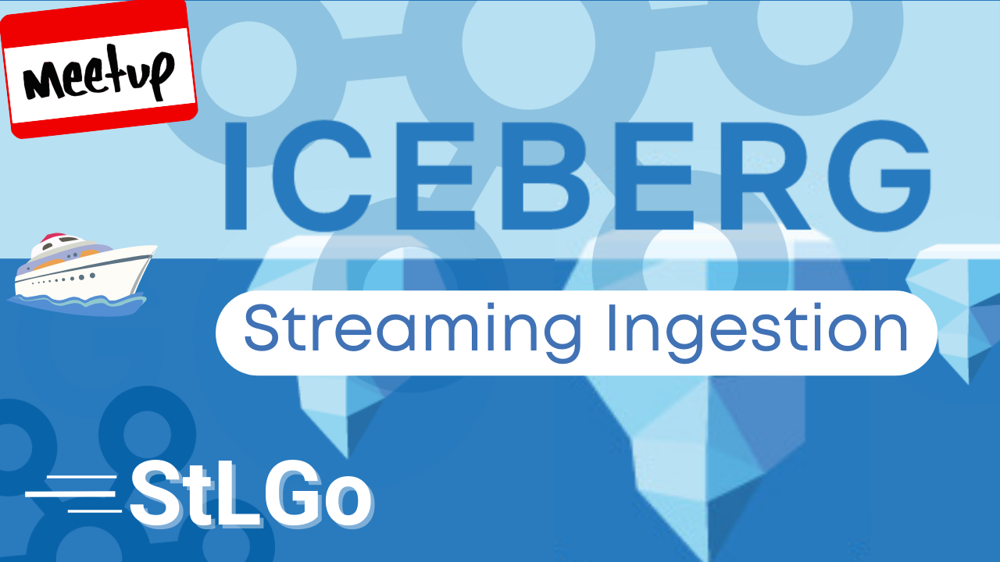
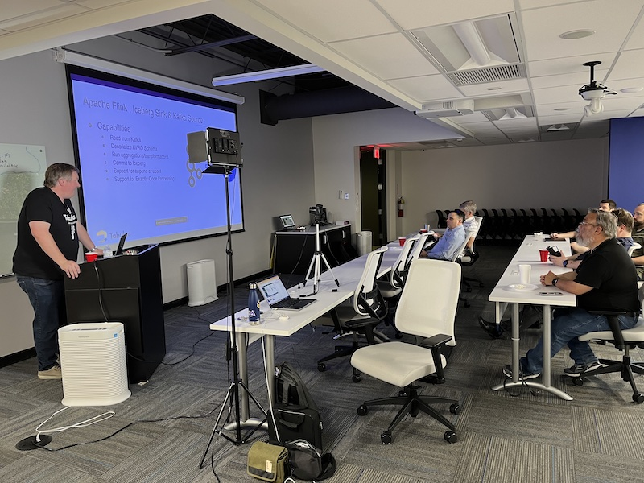
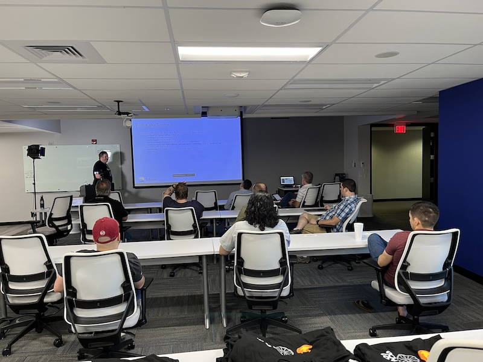
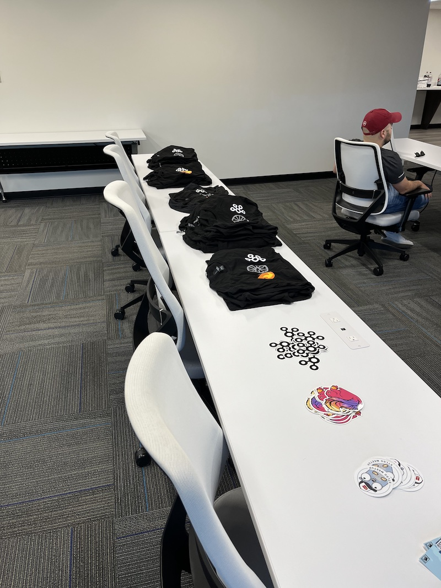
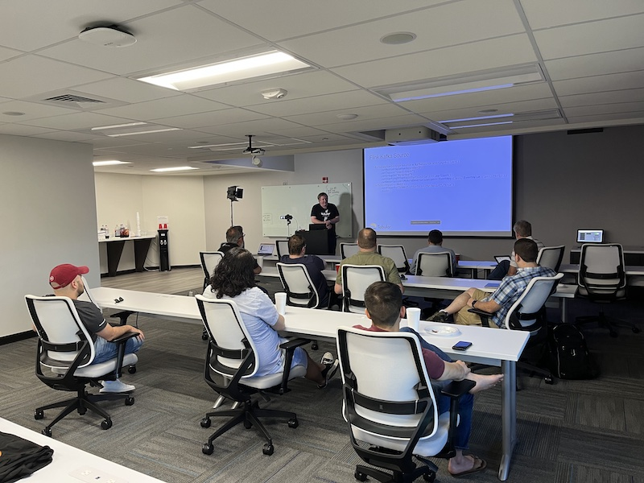

# Streaming Ingestion Into Apache Iceberg
https://www.meetup.com/kubernetes-cloud-native-stl/events/294460154/

## Meta 
| | |
| --- | --- |
| **When:** | Thursday, June 29, 2023 |
| **Where:** | [Object Computing (OCI)](https://objectcomputing.com/), 12140 Woodcrest Executive Dr. Ste 310 - St. Louis, MO 63141 |
| **Presenter:** | Cliff Gilmore |
| **Hosting Group:** | St. Louis Apache Kafka Meetup by Confluent |
| **Total Attendance:** | 12 |

## Presentation
We're spreading the news for an exciting talk from the St. Louis Apache Kafka meetup!

Join us for this in-person event as we learn about patterns for ingesting streaming data into a modern table format, such as Apache Iceberg, to manage your cloud data lake. We will discuss and explore Apache Flink connector and the new Apache Iceberg Kafka Sink. We will also cover the benefits of the Apache Iceberg file format.

## Presenter
Cliff Gilmore is an Principal Solutions Architect with years of open source data experience at companies such as DataStax, Confluent, AWS and now Tabular. He brings extensive expertise in designing and tuning distributed data systems for a multitude of use cases and every scale from a few events per seconds to many millions.

## Event
The basic agenda follows:
* 6:00pm: Doors open
* 6:00pm-6:30pm: Snack, drinks and networking
* 6:30pm-7:30pm: Feature presentation
* 7:30pm-8:00pm: Additional Q&A & Networking

For planning purposes, please register for the host's event at https://www.meetup.com/saint-louis-kafka-meetup-group/events/294183166/.

## Sponsors
* **Facilities** provided by [Object Computing (OCI)](https://objectcomputing.com/).
* **Food** from [Cecil Whitaker's Pizza](https://cwpizza.com/) provided by [Confluent](https://www.confluent.io/).

## Recording
https://www.youtube.com/watch?v=HYmo-bZa4Rw

## Action Shots
|  |  |
| --- | --- |
|  |  |
|  |  |
