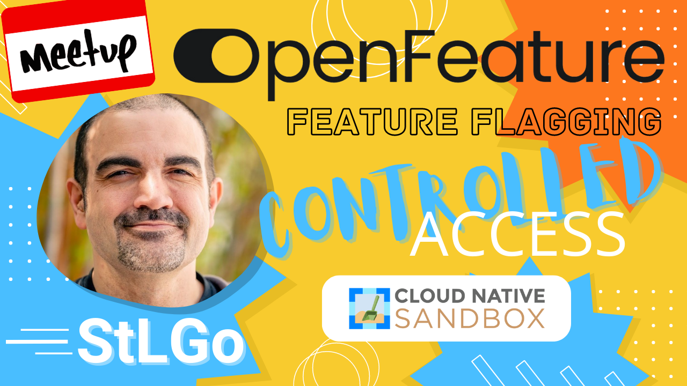

# OpenFeature: Revolutionizing Feature Management
https://www.meetup.com/kubernetes-cloud-native-stl/events/294820124/

## Meta 
| | |
| --- | --- |
| **When:** | Thursday, July 20, 2023 |
| **Where:** | [Object Computing (OCI)](https://objectcomputing.com/), 12140 Woodcrest Executive Dr. Ste 310 - St. Louis, MO 63141 |
| **Presenter:** | James Carr, [@jamescarr](https://twitter.com/jamescarr) |
| **Hosting Group:** | Kubernetes &amp; Cloud Native STL |
| **Group Membership:** | KCN-STL: 476, StLGo: 673 |
| **Total RSVPs:** | KCN-STL: 5, StLGo: 6 |
| **Total Attendance:** | 9 |

## Presentation
Join us for a comprehensive exploration into OpenFeature, an innovative, open-source feature flagging system designed to shape the future of software development. We'll unpack the vision behind the project, diving deep into `flagd` - the backbone service responsible for managing feature flags, and examine the wide array of clients developed in diverse programming languages for seamless integration. Lastly, we'll look ahead into the project's ambitious roadmap and how OpenFeature plans to continuously disrupt feature management. Whether you're an experienced software developer, a product manager, or someone fascinated by the power of feature flags, this insightful overview of [OpenFeature](https://OpenFeature.dev) is guaranteed to provide a fresh perspective.

## Presenter
[James Carr](https://james-carr.org/) is an accomplished Software Engineering Leader with over 20 years of experience in the field, specializing in a variety of programming languages and frameworks such as Java, Scala, Python, and Clojure. Despite his hearing impairment, he’s been a driving force in the industry, leading various engineering teams for the past six years. Beyond his professional sphere, he enjoys building Gundam Wing models and cherishes his roles as a loving husband and father.

## Event
The basic agenda follows:
* 5:30 - 6:00 Food and networking (Go excels at networking).
* 6:00 - 6:10 Announcements, intros, and so forth.
* 6:15 - 7:00 Main presentation of the month.
* 7:00 - 7:30 Q&A
* 7:30 - 8:00 Hang out and network

Please join us for this **in-person event**! **_Please, be sure to RSVP so that we can plan the food appropriately._** We greatly appreciate your help as we try to ensure the safety and comfort of those attending.

## Sponsors
* **Meetup Fees** covered by [CNCF](https://www.cncf.io/).
* **Facilities** provided by [Object Computing (OCI)](https://objectcomputing.com/).
* **Food** from [Jet's Pizza](https://www.jetspizza.com/) provided by [CNCF](https://WWW.cncf.io/).

## Resources
* [Meeting Intro](Meeting-Intro.pdf)

## Recording
https://youtube.com/live/Mhd2VEul-To
