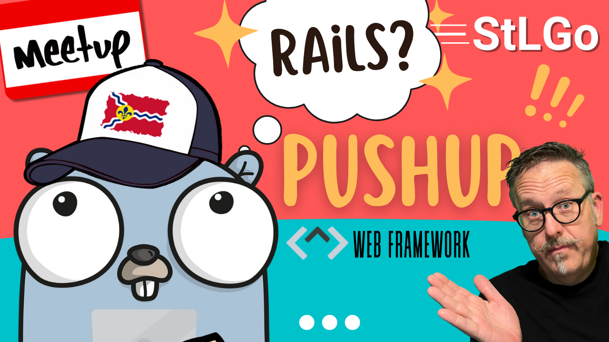

# What if Go Had Rails?
https://www.meetup.com/stl-go/events/295017166/

## Meta 
| | |
| --- | --- |
| **When:** | Thursday, August 3, 2023 |
| **Where:** | [Object Computing (OCI)](https://objectcomputing.com/), 12140 Woodcrest Executive Dr. Ste 310 - St. Louis, MO 63141 |
| **Presenter:** | Paul Balogh, [@javaducky](https://twitter.com/javaducky) |
| **Hosting Group:** | StLGo |
| **Group Membership:** | ??? |
| **Total RSVPs:** | ??? |
| **Total Attendance:** | ??? |

## Presentation
Gophers know that Go is the "go-to" language (pun intended!) for creating command-line interfaces and performant backend services with robust APIs. Unlike Ruby on Rails, building front-end web applications is not the typical use case for Go. But what if Go had Rails?

Enter [Pushup](https://pushup.adhoc.dev/), an MIT-licensed web framework focused on the front-end experience of writing templates and having an opinionated project layout translating to URL routes. As Rails did for Ruby and Django for Python, Pushup aims for Go by making it faster to develop and easier to maintain server-side web applications.

Join us as [Paul Balogh](https://www.linkedin.com/in/pabalogh/) leads the discussion and a demonstration of this early-stage project from the folks who saved America during the Healthcare.gov debacle.

## Event
The basic agenda follows:
* 5:30 - 6:00 Food and networking (Go excels at networking).
* 6:00 - 6:10 Announcements, intros, and so forth.
* 6:15 - 7:00 Main presentation of the month.
* 7:00 - 7:30 Q&A
* 7:30 - 8:00 Hang out and network

Please join us for this **in-person event**! **_Please, be sure to RSVP so that we can plan the food appropriately._** We greatly appreciate your help as we try to ensure the safety and comfort of those attending.

## Sponsors
* **Meetup Fees** covered by [GoBridge](https://github.com/gobridge/).
* **Facilities** provided by [Object Computing (OCI)](https://objectcomputing.com/).
* **Food** from ??? provided by [Grafana Labs](https://grafana.com/).
* **Giveaways** provided by ???.

## Resources
* Meeting Intro?
* Presenter Slides?
* Demo Project?

## Recording
https://www.youtube.com/watch?v=taBXbciIVVs
