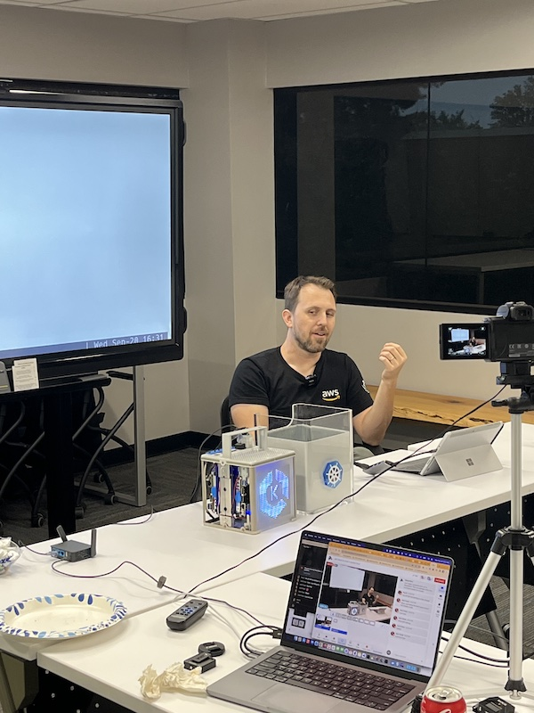
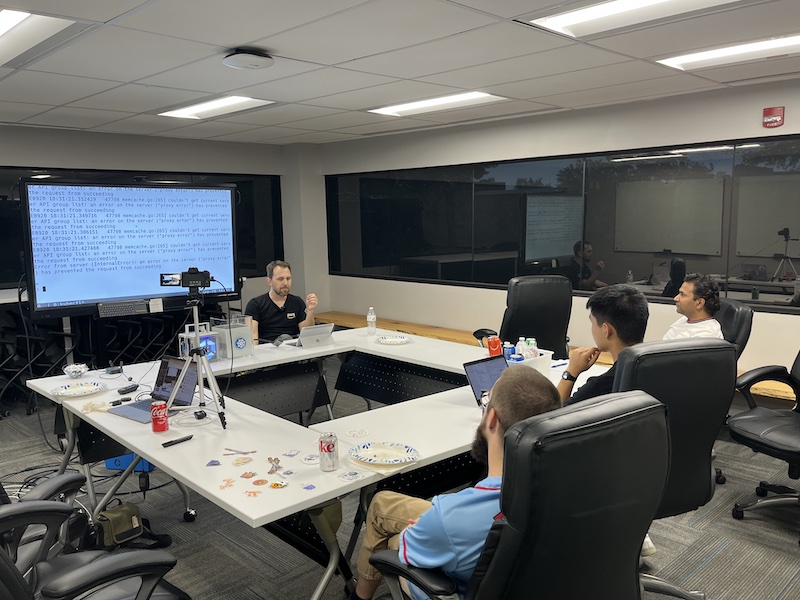

# EKS: Efficient On-Prem to Scalable Cloud
- https://community.cncf.io/events/details/cncf-saint-louis-presents-eks-efficient-on-prem-to-scalable-cloud/
- https://www.meetup.com/kubernetes-cloud-native-stl/events/295594357/

## Meta 
| | |
| --- | --- |
| **When:** | Wednesday, September 20, 2023 |
| **Where:** | [Object Computing (OCI)](https://objectcomputing.com/), 12140 Woodcrest Executive Dr. Ste 310 - St. Louis, MO 63141 |
| **Presenter:** | Justin Garrison, [@rothgar](https://twitter.com/rothgar) |
| **Hosting Group:** | Kubernetes &amp; Cloud Native STL |
| **Group Membership:** | 492 |
| **Total RSVPs:** | 12 |
| **Total Attendance:** | 5 |

## Presentation
Kubernetes provides workload portability but what about your clusters? How much of the infrastructure can be reused in different environments? We’ll show examples for what it takes to build an on-prem Kubernetes environment and then build a production environment in AWS.

## Presenter
[Justin Garrison](https://justingarrison.com/) is a developer advocate at AWS where he helps improve cloud services for everyone. He has made Oscar winning movies and built infrastructure for popular streaming services. In his spare time he tinkers with hardware and streams Moana on repeat.

## Event
The basic agenda follows:
* 5:30 - 6:00 Food and networking (Go excels at networking)
* 6:00 - 6:10 Announcements, intros, and so forth
* 6:15 - 7:00 Main presentation of the month
* 7:00 - 7:30 Q&A
* 7:30 - 8:00 Hang out and network

Please join us for this **in-person event**! **_Please, be sure to RSVP so that we can plan the food appropriately._** We greatly appreciate your help as we try to ensure the safety and comfort of those attending.

## Sponsors
* **Meetup Fees** covered by [CNCF](https://www.cncf.io/).
* **Facilities** provided by [Object Computing (OCI)](https://objectcomputing.com/).
* **Food** from [Jet's Pizza](https://www.jetspizza.com/) provided by [CNCF](https://WWW.cncf.io/).
* **Giveaways** [k6](https://k6.io/) shirts and stickers provided by [Grafana Labs](https://grafana.com/).

## Resources
* [Meeting Intro](Meeting-Intro.pdf)

## Recording
https://www.youtube.com/watch?v=XHjskSwQV6E

## Action Shots
|  |  |
| --- | --- |
|  |  |

## Bloopers
* Disaster averted thanks to [OCI](https://objectcomputing.com/) having extra meeting space; we double-booked ourselves when a [Kafka meetup](https://www.meetup.com/saint-louis-kafka-meetup-group/events/295507590/) was already scheduled there.
* Paul's meeting kickoff and presentation were muted.
* Justin's audio dropped during Q&A. 
