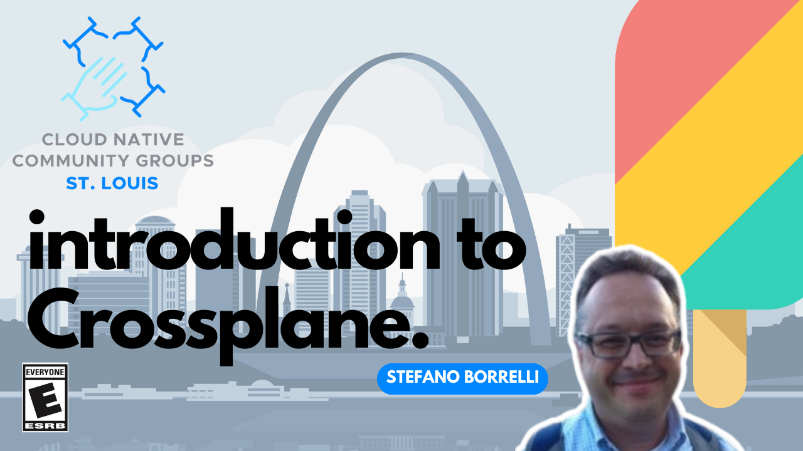
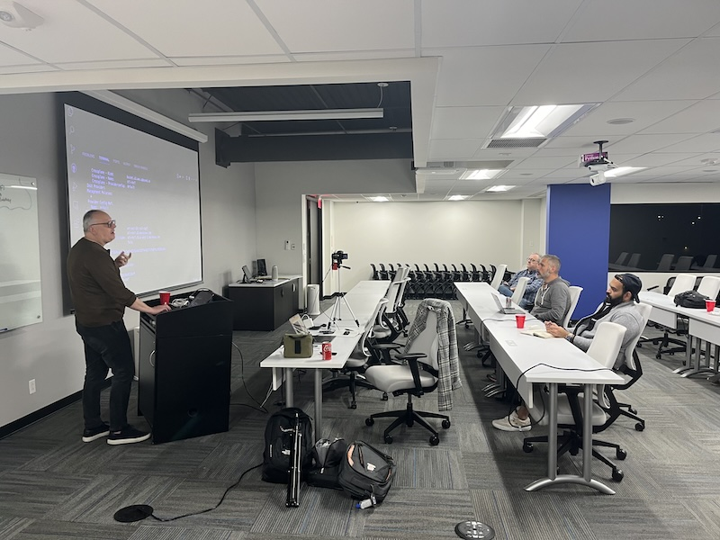
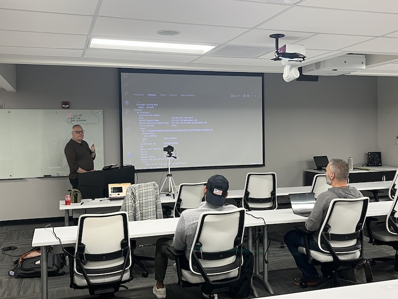

# An Introduction to Crossplane
- https://community.cncf.io/events/details/cncf-saint-louis-presents-an-introduction-to-crossplane/
- https://www.meetup.com/kubernetes-cloud-native-stl/events/297243897/

## Meta 
| | |
| --- | --- |
| **When:** | Wednesday, November 15, 2023 |
| **Where:** | [Object Computing (OCI)](https://objectcomputing.com/), 12140 Woodcrest Executive Dr. Ste 310 - St. Louis, MO 63141 |
| **Presenter:** | Steven Borrelli, [@rothgar](https://twitter.com/rothgar) |
| **Hosting Group:** | Kubernetes &amp; Cloud Native STL |
| **Group Membership:** | 498 |
| **Total RSVPs:** | 14 |
| **Total Attendance:** | 7 |

## Presentation
Join us as we learn about Crossplane, "the cloud native control plane framework" enabling you to orchestrate applications and infrastructure.

## Presenter
Steven Borrelli is a Principal Solutions Architect for Upbound.

## Event
The basic agenda follows:
* 5:30 - 6:00 Food and networking (Go excels at networking)
* 6:00 - 6:10 Announcements, intros, and so forth
* 6:15 - 7:00 Main presentation of the month
* 7:00 - 7:30 Q&A
* 7:30 - 8:00 Hang out and network

Please join us for this **in-person event**! **_Please, be sure to RSVP so that we can plan the food appropriately._** We greatly appreciate your help as we try to ensure the safety and comfort of those attending.

## Sponsors
* **Meetup Fees** covered by [CNCF](https://www.cncf.io/).
* **Facilities** provided by [Object Computing (OCI)](https://objectcomputing.com/).
* **Food** from [Jet's Pizza](https://www.jetspizza.com/) provided by [CNCF](https://WWW.cncf.io/).

## Resources
* [Meeting Intro](Meeting-Intro.pdf)

## Recording
https://www.youtube.com/watch?v=s51nHnRCz6k

## Action Shots
|  |  |
| --- | --- |
|  |  |
