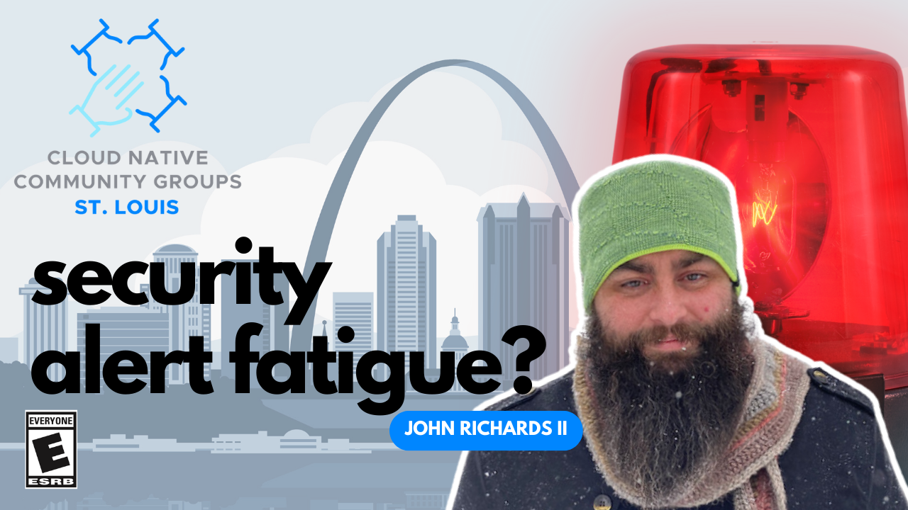

# Reduce Security Alert Fatigue – Focus on What Matters

- https://community.cncf.io/events/details/cncf-saint-louis-presents-reduce-security-alert-fatigue-focus-on-what-matters/
- https://www.meetup.com/kubernetes-cloud-native-stl/events/297820732/

## Meta 
| | |
| --- | --- |
| **When:** | Wednesday, December 13, 2023 |
| **Where:** | [Object Computing (OCI)](https://objectcomputing.com/), 12140 Woodcrest Executive Dr. Ste 310 - St. Louis, MO 63141 |
| **Presenter:** | John Richards II, [@JRastaban](https://twitter.com/JRastaban) |
| **Hosting Group:** | Kubernetes &amp; Cloud Native STL |
| **Group Membership:** | ??? |
| **Total RSVPs:** | ??? |
| **Total Attendance:** | ??? |

## Presentation
Security teams spend up to a quarter of their day prioritizing alerts, only to find that more than a third are false positives. Teams are overwhelmed as they struggle to keep up with the incessant stream of notifications vying for their attention. The siloed nature of security and DevOps teams often leaves the folks managing the stack in the dark. We’ll examine why sharing knowledge is important and how open source allows teams to adopt those processes quickly.

## Presenter
John is the Head of Dev Rel at Paladin Cloud, an open source cloud security project. He also hosts a monthly AI Security Podcast, Cyber Sentries, which explores artificial intelligence’s transformative potential on cloud security. Outside of work, John enjoys playing board games with friends and reading with a cat curled in his lap.

## Event
The basic agenda follows:
* 5:30 - 6:00 Food and networking
* 6:00 - 6:10 Announcements, intros, and so forth
* 6:15 - 7:00 Main presentation of the month
* 7:00 - 7:30 Q&A
* 7:30 - 8:00 Hang out and network

Please join us for this **in-person event**! **_Please, be sure to RSVP so that we can plan the food appropriately._** We greatly appreciate your help as we try to ensure the safety and comfort of those attending.

## Sponsors
* **Meetup Fees** covered by [CNCF](https://www.cncf.io/).
* **Facilities** provided by [Object Computing (OCI)](https://objectcomputing.com/).
* **Food** from [???]() provided by [???]().

## Resources
TODO

## Recording
TODO
