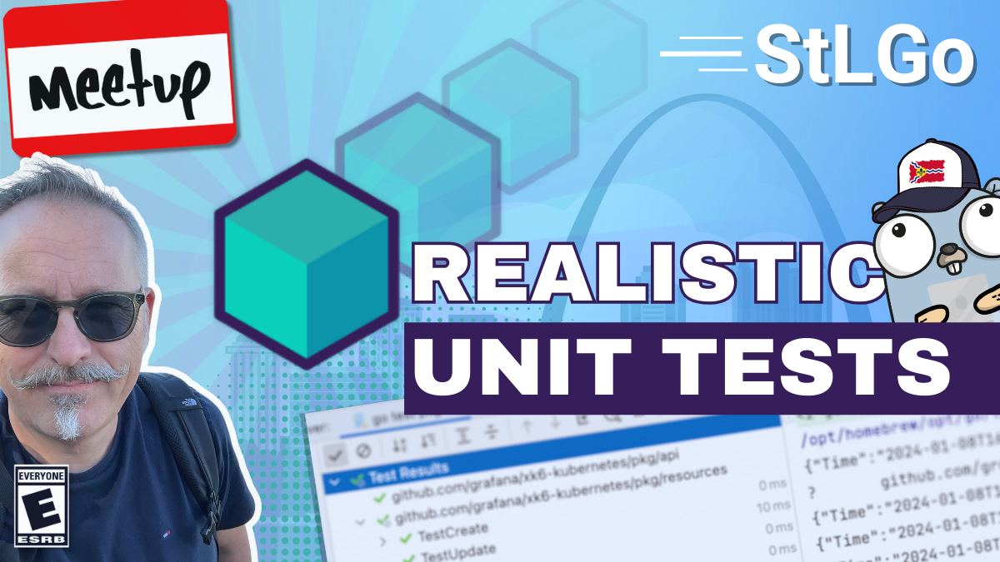

# Creating Realistic Unit Tests with Testcontainers

https://www.meetup.com/stl-go/events/298426035

## Meta 
| | |
| --- | --- |
| **When:** | Wednesday, January 24, 2024 |
| **Where:** | [Object Computing (OCI)](https://objectcomputing.com/), 12140 Woodcrest Executive Dr. Ste 310 - St. Louis, MO 63141 |
| **Presenter:** | Paul Balogh, [@javaducky](https://twitter.com/javaducky) |
| **Hosting Group:** | StLGo |
| **Group Membership:** | ??? |
| **Total RSVPs:** | ??? |
| **Total Attendance:** | ??? |

## Presentation
Sometimes, unit tests with mocked services just aren't enough. We'd like to be able to run repeatable tests against the real thing without fear of corrupting data or affecting others.

With [Testcontainers](https://testcontainers.com/), there is no need for mocks or complicated environment configurations. We can define our target environment in code and then run our tests against ephemeral containers. Java developers have had this ability for several years, but now Go developers have this similar ability!

Enjoy the discussion and demonstration of this open-source project created by the folks at [AtomicJar](https://www.atomicjar.com/), recently acquired by [Docker](https://www.docker.com/).

## Presenter
Paul is a CNCF Ambassador, GoBridge Ambassador, and a Developer Advocate at Grafana Labs. In this role, he encourages developers and testers alike to "shift left," bringing reliability testing earlier in the software development process.

## Event
The basic agenda follows:
* 5:30 - 6:00 Food and networking (Go excels at networking)
* 6:00 - 6:10 Announcements, intros, and so forth
* 6:15 - 7:00 Main presentation of the month
* 7:00 - 7:30 Q&A
* 7:30 - 8:00 Hang out and network

Please join us for this **in-person event**! **_Please be sure to RSVP so that we can plan the food appropriately._** We greatly appreciate your help as we try to ensure the safety and comfort of those attending.

## Sponsors
* **Meetup Fees** covered by [GoBridge](https://github.com/gobridge/).
* **Facilities** provided by [Object Computing (OCI)](https://objectcomputing.com/).
* **Food** from [???]() provided by [Grafana Labs](https://grafana.com/).

## Resources
* [TODO Meeting Intro]()
* [TODO Presenter Slides]()
* [TODO Demo Project]()

## Recording
https://www.youtube.com/watch?v=sX4s1HqPZcw
