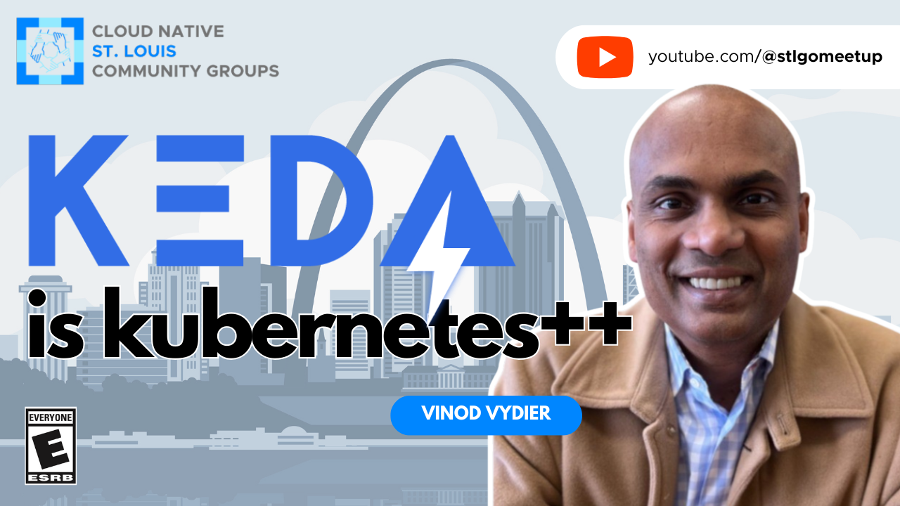

# KEDA is Kubernetes++

- https://community.cncf.io/events/details/cncf-saint-louis-presents-keda-is-kubernetes/
- https://www.meetup.com/kubernetes-cloud-native-stl/events/299380238/

## Meta 
| | |
| --- | --- |
| **When:** | Wednesday, March 13, 2024 |
| **Where:** | [Object Computing (OCI)](https://objectcomputing.com/), 12140 Woodcrest Executive Dr. Ste 310 - St. Louis, MO 63141 |
| **Presenter:** | Vinod Vydien, [@vvydier](https://twitter.com/vvydier) |
| **Hosting Group:** | Kubernetes &amp; Cloud Native STL |
| **Group Membership:** | 506 (25 in Bevy) |
| **Total RSVPs:** | 18 |
| **Total Attendance:** | 10 |

## Presentation
A major benefit of using Kubernetes has been addition of the _Horizontal Pod Autoscaler (HPA)_. This enables your application workloads to scale up or down based on demand. HPA fits some of our need, but determining the need for scaling goes beyond CPU utilization and HTTP requests.

Join us as we explore [KEDA](https://keda.sh/), the _Kubernetes Event-driven Autoscaler_. This [Cloud Native Computing Foundation (CNCF)](https://cncf.io/) graduated project works alongside the standard Kubernetes HPA, extending functionality. With KEDA, you can drive the scaling of any container in Kubernetes based on the number of events needing to be processed.

Some of the topics we'll cover include:
- scaling options in Kubernetes
- why you might use KEDA
- KEDA architecture and how it works

We'll also include demo of KEDA auto scaling based upon messages in a [RabbitMQ](https://www.rabbitmq.com/) cluster.

## Presenter
Vinod is an Observability Specialist in Cloud Native and container/Kubernetes environments. He also works as an OpenTelemetry contributor/approver and worked at [Observe](https://www.observeinc.com/) and [New Relic](https://newrelic.com/) before [Splunk](https://www.splunk.com/). He enjoys working with local companies and helping them in their cloud journey and would love to meet and discuss how things are going in your project as folks are increasingly adopting Cloud Native technologies.

## Event
The basic agenda follows:
* 5:30 - 6:00 Food and networking (Go excels at networking)
* 6:00 - 6:10 **LIVESTREAM** begins with announcements, intros, etc.
* 6:15 - 7:00 Main presentation of the month
* 7:00 - 7:30 Q&A
* 7:30 - 8:00 Hang out and network

Please join us for this **in-person event**! **_Please, be sure to RSVP so that we can plan the food appropriately._** We greatly appreciate your help as we try to ensure the safety and comfort of those attending.

## Sponsors
* **Meetup Fees** covered by [CNCF](https://cncf.io/).
* **Facilities** provided by [Object Computing (OCI)](https://objectcomputing.com/).
* **Food** from [Jet's Pizza](https://www.jetspizza.com/) provided by [CNCF](https://cncf.io/).

## Resources
* [Meeting Intro](Meeting-Intro.pdf)

## Recording

https://www.youtube.com/watch?v=Yg6llTbRvyY

## Action Shots
|  |  |
| --- | --- |
|  |  |
|  |  |
