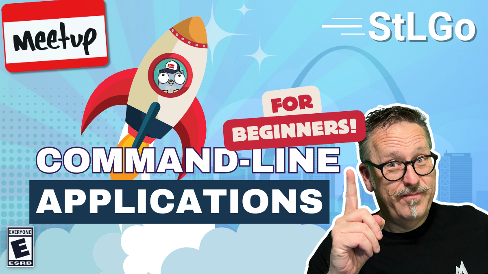

# Get Started With Command-Line Applications

https://www.meetup.com/stl-go/events/299994415

## Meta 
| | |
| --- | --- |
| **When:** | Wednesday, March 27, 2024 |
| **Where:** | [Object Computing (OCI)](https://objectcomputing.com/), 12140 Woodcrest Executive Dr. Ste 310 - St. Louis, MO 63141 |
| **Presenter:** | Paul Balogh |
| **Hosting Group:** | StLGo |
| **Group Membership:** | ??? |
| **Total RSVPs:** | ??? |
| **Total Attendance:** | ??? |

## Presentation
As developers, we often have our first introduction to a language by completing a "Hello World" tutorial. Often, this is a simplified example of a command-line application.

Let's dig deeper into creating a command-line application you can actually use. We'll see just how easy it is to convert brittle shell scripts to create a powerful, user-friendly tool. We'll include an overview of awesome libraries like Cobra, Viper, Pflag, among others, comparing them to functionality provided by the Go standard library.

## Presenter
Paul is a CNCF Ambassador and GoBridge Volunteer working as a Software Architect with NISC. You may have caught him in the recent past, speaking at conferences as a Developer Advocate with Grafana Labs. He makes a habit of encouraging developers and testers alike to "shift left," bringing reliability testing earlier in the software development process.

## Event
The basic agenda follows:
* 5:30 - 6:00 Food and networking
* 6:00 - 6:10 **LIVESTREAM** begins with announcements, intros, etc.
* 6:15 - 7:00 Main presentation of the month
* 7:00 - 7:30 Q&A
* 7:30 - 8:00 Hang out and network

Please join us for this **in-person event**! **_Please be sure to RSVP so that we can plan the food appropriately._** We greatly appreciate your help as we try to ensure the safety and comfort of those attending.

_We'd love to see you in person, but if you're unable to make it, our event will be LIVESTREAMED on our [YouTube channel](https://www.youtube.com/@stlgomeetup). Be sure to ask questions and interact with the rest of the group using the YouTube chat feature!_

## Sponsors
* **Meetup Fees** covered by [GoBridge](https://github.com/gobridge/).
* **Facilities** provided by [Object Computing (OCI)](https://objectcomputing.com/).
* **Food** from [???]() provided by [Sketch Development](https://www.sketchdev.io/).

## Resources
* [Meeting Intro](Meeting-Intro.pdf)

## Recording
https://www.youtube.com/watch?v=vKC5ciayl4g
