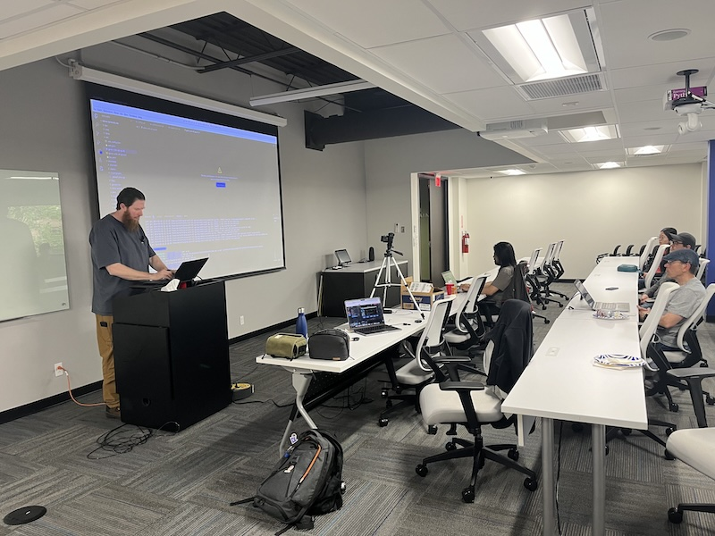
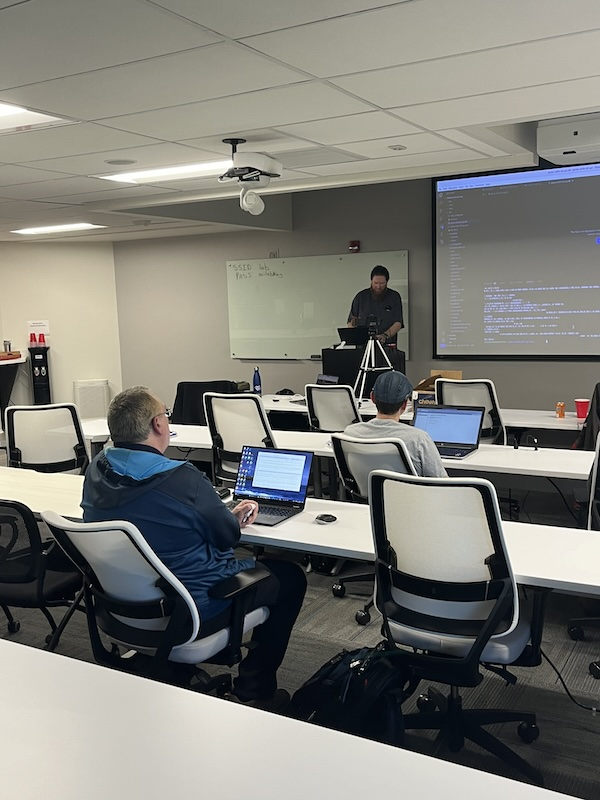
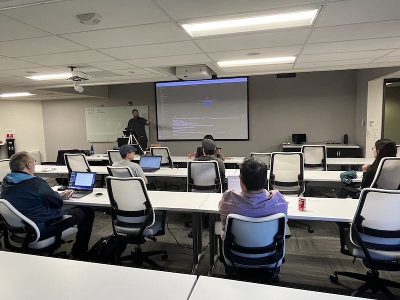

# Creating Secure Applications with Go

https://www.meetup.com/stl-go/events/299123667

## Meta 
| | |
| --- | --- |
| **When:** | Wednesday, April 24, 2024 |
| **Where:** | [Object Computing (OCI)](https://objectcomputing.com/), 12140 Woodcrest Executive Dr. Ste 310 - St. Louis, MO 63141 |
| **Presenter:** | Andy Schiefelbein |
| **Hosting Group:** | StLGo |
| **Group Membership:** | 710 |
| **Total RSVPs:** | 12 |
| **Total Attendance:** | 9 |

## Presentation
Join us to learn how you can create secure applications using Go. 

This session will be the second in our "Grow with STL Go" series of workshops for beginners. You'll learn where and when to use cryptography to secure data on disk and in transit while minimizing unintentional data leaks.

If you are just getting started with Go development, this is an ideal session for you!

## Presenter
Andy Schiefelbein is currently working in cyber security at a telecommunications company. He has had a 26 year career in technology, has a Masters in Computer Science, and 7 software patents to his name.

When not toiling away the hours in the underground digital salt mines you can often find him playing bass trombone in various organizations around town or volunteering with the Missouri Master Gardners.

## Event
The basic agenda follows:
* 5:30 - 6:00 Food and networking
* 6:00 - 6:10 **LIVESTREAM** begins with announcements, intros, etc.
* 6:15 - 7:00 Main presentation of the month
* 7:00 - 7:30 Q&A
* 7:30 - 8:00 Hang out and network

Please join us for this **in-person event**! **_Please be sure to RSVP so that we can plan the food appropriately._** We greatly appreciate your help as we try to ensure the safety and comfort of those attending.

_We'd love to see you in person, but if you're unable to make it, our event will be LIVESTREAMED on our [YouTube channel](https://www.youtube.com/@stlgomeetup). Be sure to ask questions and interact with the rest of the group using the YouTube chat feature!_

## Sponsors
* **Meetup Fees** covered by [GoBridge](https://github.com/gobridge/).
* **Facilities** provided by [Object Computing (OCI)](https://objectcomputing.com/).
* **Food** from [Jet's Pizza](https://www.jetspizza.com/) provided by [CloudGnome](https://cloudgnome.dev/).

## Resources
* [Meeting Intro](Meeting-Intro.pdf)
* [Demo Project](https://github.com/stlgo/grow-with-stl-go)

## Recording
https://www.youtube.com/watch?v=H3-tK_sDWYY

## Action Shots
|  |  |
| --- | --- |
|  |  |
|  | |
