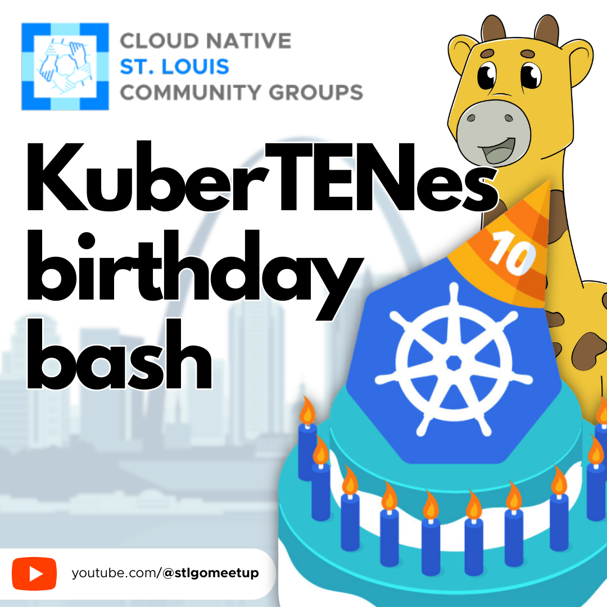
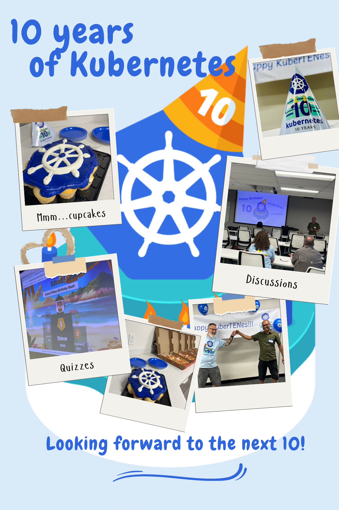

# KuberTENes Birthday Bash

https://community.cncf.io/events/details/cncf-saint-louis-presents-kubertenes-birthday-bash-st-louis/

## Meta 
| | |
| --- | --- |
| **When:** | Wednesday, June 12, 2024 |
| **Where:** | [Object Computing (OCI)](https://objectcomputing.com/), 12140 Woodcrest Executive Dr. Ste 310 - St. Louis, MO 63141 |
| **Presenters:** | [Paul Balogh](https://cloudgnome.dev/), [Vinod Vydien](https://twitter.com/vvydier) |
| **Hosting Group:** | Cloud Native Community Group St. Louis |
| **Group Membership:** | 41 |
| **Total RSVPs:** | 6 |
| **Total Attendance:** | 7 |

## Presentation
Help us celebrate the 10th year of Kubernetes!

## Event
The basic agenda follows:
* 5:30 - 6:00 Food and networking
* 6:00 - 6:15 Announcements, intros, and so forth
* 6:15 - 7:00 Main Presentation
* 7:00 - 7:30 Q&A and Discussion
* 7:30 - 8:00 Hang out and network

Please join us for this **in-person event**! **_Please be sure to RSVP so that we can plan the food appropriately._** We greatly appreciate your help as we try to ensure the safety and comfort of those attending.

## Sponsors
* **Meetup Fees** covered by [CNCF](https://cncf.io/).
* **Facilities** provided by [Object Computing (OCI)](https://objectcomputing.com/).
* **Food** from [Jet's Pizza](https://www.jetspizza.com/) provided by [CNCF](https://cncf.io/).

## Giveaways
Of course, there were stickers, but several lucky in-person attendees also walked away with some sweet baseball caps from CNCF projects: [Prometheus](https://prometheus.io/), [Containerd](https://containerd.io/), [Argo](https://argoproj.github.io/cd/), and [Etcd](https://etcd.io/)! Thanks to the [Cloud Native Computing Foundation (CNCF)](https://cncf.io/) for providing the swag.

## Resources
* [Meeting Intro](Meeting-Intro.pdf)
* [Kahoot Trivia Game](https://create.kahoot.it/share/kubertenes-birthday-bash/3dca4984-f258-470c-99cb-24b96b452895), thanks to [Carlos Santana](https://www.santana.dev/)

## Action Shots

