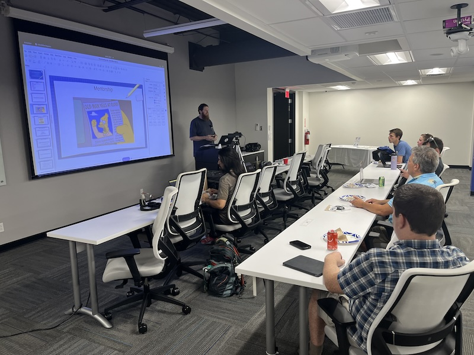
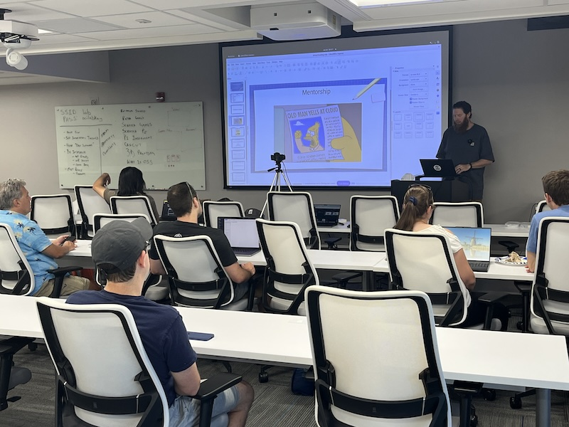

# Hosting Your Sites Using Golang

https://www.meetup.com/stl-go/events/302078973/

## Meta 
| | |
| --- | --- |
| **When:** | Wednesday, July 24, 2024 |
| **Where:** | [Object Computing (OCI)](https://objectcomputing.com/), 12140 Woodcrest Executive Dr. Ste 310 - St. Louis, MO 63141 |
| **Presenter:** | Andy Schiefelbein |
| **Hosting Group:** | StLGo |
| **Group Membership:** | 737 |
| **Total RSVPs:** | 13 |
| **Total Attendance:** | 10 |

## Presentation

Virtual web hosting allows you to run your own websites. Using Golang alone, you can create your own web server without the need for additional software like Apache HTTPD or Nginx.

Host your own static HTML and Javascript website, or a fully active backend webservice! You will even get tips and tricks on how to do this in a scaled application.

Here are a few points we'll be covering with this informative session:
- Apache HTTPD and Nginx
- CGI with Perl, Python, and PHP
- Webservices with SOAP and REST
- Dealing with high volumes and load balancing

This talk will culminate with a code walk-through and demonstration of hosting your own sites using native Go functionality.

## Presenter
Andy Schiefelbein is currently working in cyber security at a telecommunications company. He has had a 26 year career in technology, has a Masters in Computer Science, and 7 software patents to his name.

When not toiling away the hours in the underground digital salt mines you can often find him playing bass trombone in various organizations around town or volunteering with the Missouri Master Gardners.

## Event
The basic agenda follows:
* 5:30 - 6:00 Food and networking (Go excels at networking).
* 6:00 - 6:10 **LIVESTREAM** begins with announcements, intros, etc.
* 6:15 - 7:00 Main presentation of the month.
* 7:00 - 7:30 Q&A
* 7:30 - 8:00 Hang out and network

Please join us for this **in-person event**! **_Please be sure to RSVP so that we can plan the food appropriately._** We greatly appreciate your help as we try to ensure the safety and comfort of those attending.

_We'd love to see you in person, but if you're unable to make it, our event will be LIVESTREAMED on the [STL Tech Meetups YouTube channel](https://www.youtube.com/channel/UCdCEvdZ-QiMJo9pyinBKG9A). Be sure to ask questions and interact with the rest of the group using the YouTube chat feature!_

## Sponsors
* **Meetup Fees** covered by [GoBridge](https://github.com/gobridge/).
* **Facilities** provided by [Object Computing (OCI)](https://objectcomputing.com/).
* **Food** from [Jet's Pizza](https://www.jetspizza.com/) provided by [CloudGnome](https://cloudgnome.dev/).

## Giveaways
Of course, there were stickers, but several lucky in-person attendees also walked away with items from a mixed bag of baseball caps, t-shirts, pizza cutters, and sunglasses! Thanks to the [Cloud Native Computing Foundation (CNCF)](https://cncf.io/), [Bayer Crop Science](https://www.cropscience.bayer.us/), [NISC](https://nisc.coop/) for providing the swag.

## Resources
* [Meeting Intro](Meeting-Intro.pdf)
* [Demo Project](https://github.com/stlgo/grow-with-stl-go)

## Recording

https://www.youtube.com/watch?v=NrdioCQpU7E

## Action Shots
|  |  |
| --- | --- |
|  |  |
