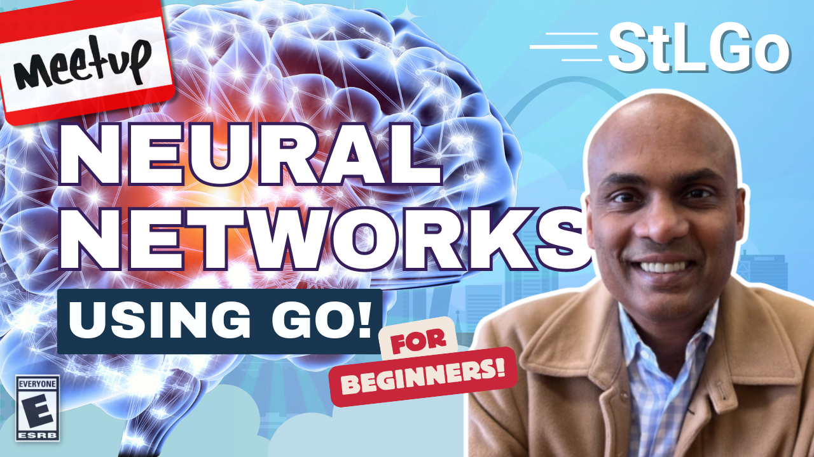

# Neural Networks and Machine Learning in Go

https://www.meetup.com/stl-go/events/303415976

## Meta 
| | |
| --- | --- |
| **When:** | Wednesday, September 24, 2024 |
| **Where:** | [Object Computing (OCI)](https://objectcomputing.com/), 12140 Woodcrest Executive Dr. Ste 310 - St. Louis, MO 63141 |
| **Presenter:** | Vinod Vydier, [@vvydier](https://twitter.com/vvydier) |
| **Hosting Group:** | StLGo |
| **Group Membership:** | ??? |
| **Total RSVPs:** | ??? |
| **Total Attendance:** | ??? |

## Presentation
In this talk, we will cover the basics of Neural Networks which is the basis of Machine Learning algorithms. Starting from first principles and in Golang - we'll discuss how machines learn and recognize patterns just as humans, but with math.

Whether you're a newcomer to Go or aspiring to delve into web application development using our favorite language, this session promises to be both enlightening and practical. Don't miss out on learning and taking your Go development skills to the next level!

## Presenter
Vinod is an Observability Specialist in Cloud Native and container/Kubernetes environments. He also works as an OpenTelemetry contributor/approver and worked at Observe and New Relic before Splunk. He enjoys working with local companies and helping them in their cloud journey and would love to meet and discuss how things are going in your project as folks are increasingly adopting Cloud Native technologies.

## Event
The basic agenda follows:
* 5:30 - 6:00 Food and networking (Go excels at networking).
* 6:00 - 6:10 Announcements, intros, etc.
* 6:15 - 7:00 Main presentation of the month.
* 7:00 - 7:30 Q&A
* 7:30 - 8:00 Hang out and network

Please join us for this **in-person event**! **_Please be sure to RSVP so that we can plan the food appropriately._** We greatly appreciate your help as we try to ensure the safety and comfort of those attending.

## Sponsors
* **Meetup Fees** covered by [GoBridge](https://github.com/gobridge/).
* **Facilities** provided by [Object Computing (OCI)](https://objectcomputing.com/).
* **Food** from [???]() provided by [???]().

## Resources

## Recording

https://www.youtube.com/watch?v=HM7evzhi66c
