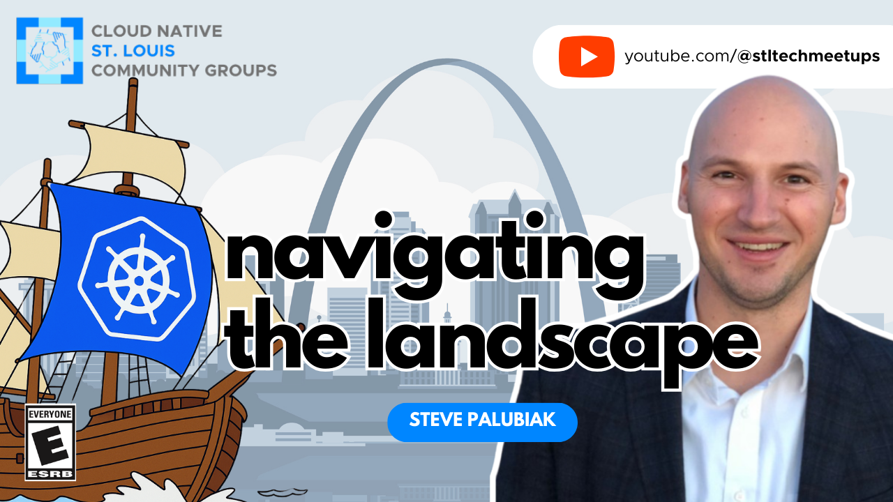

# CNCF Landscape and the Cloud Native Journey

https://community.cncf.io/events/details/cncf-saint-louis-presents-cncf-landscape-and-the-cloud-native-journey/

## Meta 
| | |
| --- | --- |
| **When:** | Wednesday, May 7, 2025 |
| **Where:** | [Object Computing (OCI)](https://objectcomputing.com/), 12140 Woodcrest Executive Dr. Ste 310 - St. Louis, MO 63141 |
| **Presenter:** | Steve Palubiak |
| **Hosting Group:** | Cloud Native Community Group St. Louis |
| **Group Membership:** | ??? |
| **Total RSVPs:** | ??? |
| **Total Attendance:** | ??? |

## Presentation
The cloud native ecosystem is exploding with innovation—but with over 800 CNCF projects, choosing the right tools can quickly become overwhelming. This session is about cutting through the noise and providing a clear, high-level look at the landscape.

We’ll take a practical tour of what it means to go cloud native today, spotlighting foundational projects like Kubernetes, ArgoCD, and Dapr. From GitOps and Helm to Cluster API, we’ll explore the tools shaping modern infrastructure—and share how teams are building platforms that align with their needs, not someone else’s opinionated blueprint.

## Presenter
Steven Palubiak works with teams to simplify and scale their infrastructure—whether they're running virtual machines, containers, or a mix of both. He partners with engineers and architects who are asking practical questions: How do we make this easier to manage? How do we scale without adding complexity?

At Spectro Cloud, Steven helps organizations adopt Kubernetes on their own terms. The platform is fully CNCF-conformant and designed to run anywhere—cloud, bare metal, or edge—without locking teams into a rigid stack.

## Event
The basic agenda follows:
* 5:30 - 6:00 Food and networking
* 6:00 - 6:15 Announcements, intros, and so forth
* 6:15 - 7:00 Main Presentation
* 7:00 - 7:30 Q&A and Discussion
* 7:30 - 8:00 Hang out and network

Please join us for this **in-person event**! **_Please be sure to RSVP so that we can plan the food appropriately._** We greatly appreciate your help as we try to ensure the safety and comfort of those attending.

## Sponsors
* **Meetup Fees** covered by [CNCF](https://cncf.io/).
* **Facilities** provided by [Object Computing (OCI)](https://objectcomputing.com/).
* **Food** from [???]() provided by [Spectro Cloud](https://www.spectrocloud.com/).

## Resources
TODO

## Recording
https://www.youtube.com/watch?v=EpIcU6kgM6w
