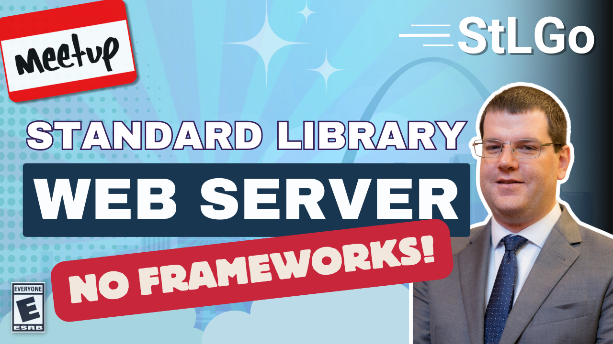

# No Frameworks: Implement Your Web Server with Go's Standard Library

https://www.meetup.com/stl-go/events/307792387/

## Meta 
| | |
| --- | --- |
| **When:** | Wednesday, May 28, 2025 |
| **Where:** | [Microsoft Offices](https://microsoft.com/), 4220 Duncan Ave #501 St. Louis, MO 63110 |
| **Presenter:** | Scott Anderson |
| **Hosting Group:** | StLGo |
| **Group Membership:** | 793 |
| **Total RSVPs:** | 23 |
| **Total Attendance:** | ??? |

## Presentation
NO FRAMEWORKS:  Implement your web server with Go's standard library

Many of us implement web servers in our jobs and hobbies, and we often expect to use frameworks when doing so. Attempting to get something done without them feels like an academic exercise, but what do we really lose if we avoid frameworks?  In Go, not much!

## Presenter
Scott Anderson is a Data Engineering and Cloud Architecture Consultant, focused on building integrations and features for data lakehouse platforms. He enjoys solving problems with multiple frameworks and tools, but presently writes in Go in a multi-cloud environment. He also enjoys developing AI applications and developer experience tooling.

## Event
The basic agenda follows:
* 5:30 - 6:00 Food and networking (Go excels at networking).
* 6:00 - 6:10 Announcements, intros, etc.
* 6:15 - 7:00 Main presentation of the month.
* 7:00 - 7:30 Q&A
* 7:30 - 8:00 Hang out and network

Please join us for this **in-person event**! **_Please be sure to RSVP so that we can plan the food appropriately._** We greatly appreciate your help as we try to ensure the safety and comfort of those attending.

## Sponsors
* **Meetup Fees** covered by [GoBridge](https://github.com/gobridge/).
* **Facilities** provided by [Microsoft](https://microsoft.com/).
* **Food** from [Spectro Cloud](https://www.spectrocloud.com/) provided by [???]().

## Resources
TODO

## Recording
https://www.youtube.com/watch?v=tzqVAuqMarQ
