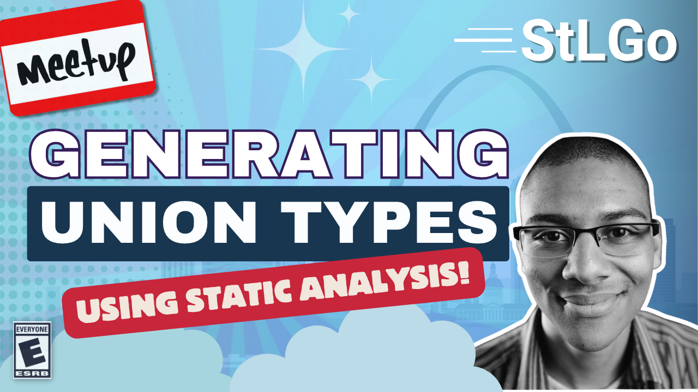

# Generating Union Types from Go Structs with Static Analysis

https://www.meetup.com/stl-go/events/308835143

## Meta 
| | |
| --- | --- |
| **When:** | Wednesday, July 23, 2025 |
| **Where:** | [Microsoft Offices](https://microsoft.com/), 4220 Duncan Ave #501 St. Louis, MO 63110 |
| **Presenter:** | K. Matthew DuPree |
| **Hosting Group:** | StLGo |
| **Group Membership:** | 809 |
| **Total RSVPs:** | 15 |
| **Total Attendance:** | ??? |

## Presentation
Generating Union Types from Go Structs with Static Analysis

Go doesn't have union types, but the server endpoints we've implemented in go accept data with union types. This talk is about how used static analysis and 'go generate to add union types to our autogenerated server docs and schema validation.

## Presenter
Matt is a Founding Engineer at a Series-A fintech and AI startup. He was previously a VC-backed founder and worked in data science and engineering at Heap. His writing, which explores the intersection of technology and philosophy, can be found at [philosophicalhacker.com](https://philosophicalhacker.com).

## Event
The basic agenda follows:
* 5:30 - 6:00 Food and networking (Go excels at networking).
* 6:00 - 6:10 Announcements, intros, etc.
* 6:15 - 7:00 Main presentation of the month.
* 7:00 - 7:30 Q&A
* 7:30 - 8:00 Hang out and network

Please join us for this **in-person event**! **_Please be sure to RSVP so that we can plan the food appropriately._** We greatly appreciate your help as we try to ensure the safety and comfort of those attending.

## Sponsors
* **Meetup Fees** covered by [GoBridge](https://github.com/gobridge/).
* **Facilities** provided by [Microsoft](https://microsoft.com/).
* **Food** from [???]() provided by [Spectro Cloud](https://www.spectrocloud.com/).

## Resources

* [Meeting Intro](Meeting-Intro.pdf)

## Recording
https://www.youtube.com/watch?v=RMVdhkolpV0
